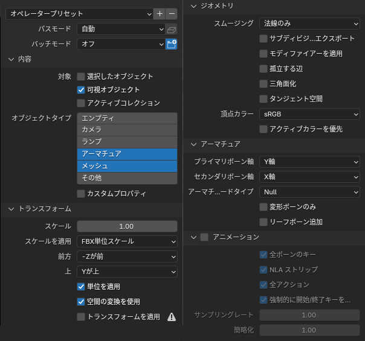

# ノウハウ
## Export FBX
Blender で Unity 向けに fbx をエクスポートする際の設定。

* 対象: `可視オブジェクト` (見えているオブジェクトのみを出力させる)
* オブジェクトタイプ: `アーマチュア`、`メッシュ` (照明などは出力に含めない)
* トランスフォーム:
  * スケール: `1.00`
  * スケールを適用: `FBX単位スケール`
  * 前方: `-Zが前`
  * 上: `Yが上`
  * 単位を適用: **有効**
  * 空間の変換を使用: **有効**
  * トランスフォームを適用: 無効

参考画像

## PBR on lilToon
画像の箇所には Substance Painter のエクスポートの設定値を記載。

| lilToon          | 設定項目             | 設定値                                             |
| ---------------- | -------------------- | -------------------------------------------------- |
| メインカラー     | 色                   | (画像 RGB: BaseColor, A: Opacity, sRGB: o)         |
| メインカラー 2nd | 色                   | (画像 Grayscale: Mixed AO, sRGB: o)                |
| メインカラー 2nd | 合成モード           | 乗算                                               |
| 影               | 影色1                | #000000                                            |
| 影               | 範囲                 | 適当                                               |
| 影               | ぼかし               | 適当                                               |
| 影               | 影色2                | #000000                                            |
| 影               | 影色への環境光影響度 | 1.0                                                |
| 影               | AO Map               | (画像 Grayscale: Mixed AO, sRGB: x)                |
| ノーマルマップ   | ノーマルマップ       | (画像 RGB: Normal OpenGL, sRGB: x)                 |
| 反射             | 滑らかさ             | (画像 Grayscale: Glossiness, sRGB: x)              |
| 反射             | 金属度               | (画像 Grayscale: Metallic, A: Glossiness, sRGB: x) |
| 反射             | 反射率               | 適当                                               |
| 反射             | 光沢のタイプ         | リアル                                             |
| 反射             | 環境光の反射         | 有効                                               |
| マットキャップ   | マスク               | (画像 Grayscale: Metallic, sRGB: x)                |

## 出品前チェックポイント
* Blender
  * 位置・回転・スケールが正規化されている事 … 適用を使う
  * 頂点毎のウェイト数は4以下にする (unity の制約)
  * 頂点毎のウェイト合計は1にする (正規化)
  * ボーンにリーフボーンが追加されている事
* Unity
  * Bounds がアバターを囲うサイズになっている事
  * マテリアルがフォールバックを考慮している事 … lilToon の色調変更などをベイクする
* 商品説明
  * ポリゴン、マテリアル数 … 買い手が質を見極める材料として必要
  * モデリングツール … fbx の状態の参考

# リンク集
## アセット
* [lilToon](https://lilxyzw.github.io/lilToon/#/)
* [ユニティちゃんトゥーンシェーダー](https://github.com/unity3d-jp/UnityChanToonShaderVer2_Project/blob/release/legacy/2.0/README_ja.md)
* [らずべりー式 睡眠システム(ベータ)](https://booth.pm/ja/items/4373167)

## スクリーンシェーダー
* https://vrcmods.com/item/4300
* https://www.luka.moe/june
* https://github.com/xwidghet/StereoCancer
* https://github.com/MochiesCode/Mochies-Unity-Shaders
* https://github.com/netri/Neitri-Unity-Shaders
* https://booth.pm/ja/items/1095863
* https://discord.com/invite/MdykFMf

## ツール
* [Modular Avatar](https://modular-avatar.nadena.dev/ja)
* [VRCQuestTools](https://booth.pm/ja/items/2436054)
* [OVR Advanced Settings](https://store.steampowered.com/app/1009850/OVR_Advanced_Settings/)
* [XSOverlay](https://store.steampowered.com/app/1173510/XSOverlay/?l=japanese)

## ナレッジ
* [そうだ、空を飛ぼう。VRChatで空を飛ぶもっとも簡単な方法](https://note.com/karihito/n/ndfb801abcf04)
* [【VRChat】物を持ったり離したり！疑似ピックアップを使ってみた♪♪](https://keiki002.com/vr/fake-pickup/)
