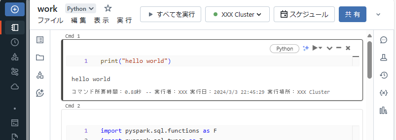
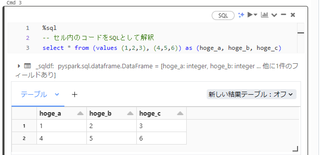
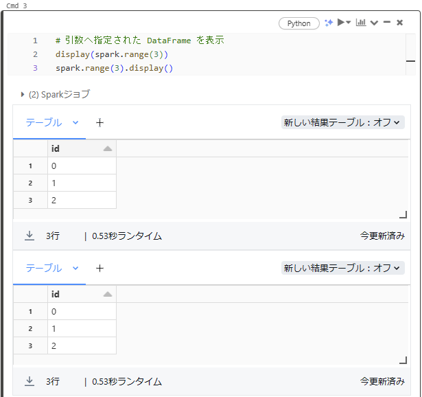
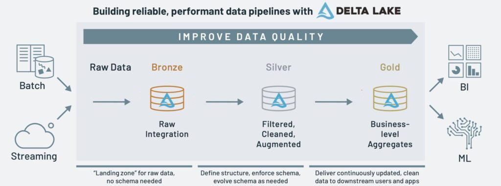

# ノートブック
## セル
ノートブック内でコードを実行できる。実行はセル単位で行われ、既定では Python として解釈される。これはマジックコマンドを用いることで他言語として実行することも可能。



## マジックコマンド
セル先頭に特定のキーワードを入れるとセルの動作モードが変化する。その他、様々なコマンドも使用可能。

| Command | Description                                        |
| ------- | -------------------------------------------------- |
| %python | セル内を Python として実行する                     |
| %sql    | セル内を SQL として実行する                        |
| %run    | 指定したノートブックを実行する                     |
| %fs     | DBFS (後述) の中を照会                             |
| %sh     | クラスターのドライバー内でシェルコマンドを実行する |
| %pip    | クラスターの全ノードで pip コマンドを実行する      |



## アウトプット
display を用いると DataFrame を表形式で描画できる。操作することでグラフなども作れる。



## パラメータ
外部からパラメータとして値を入力可能。型は文字列のみ。

```py
# python 版

dbutils.widgets.text("hoge", "sample text", "hoge_label")
dbutils.widgets.dropdown("fooo", "val1", ["val1", "val2", "val3"], "fooo_label")

hoge = dbutils.widgets.get("hoge")
fooo = dbutils.widgets.get("fooo")
print(hoge, fooo)

```

```sql
-- SQL 版

CREATE WIDGET TEXT `hoge` DEFAULT "sample text";
CREATE WIDGET DROPDOWN `fooo` DEFAULT "val1"
  CHOICES SELECT * FROM VALUES ("val1"), ("val2"), ("val3");

SELECT "${hoge}", "${fooo}"

```

# ストレージ
## DBFS
ストレージにはローカルとDBFSがある。
DBFSを挟むことで S3 を始めとするオブジェクトストレージへの読み書きを抽象化する。

```py
# ローカルファイルシステム
%fs ls file:/
dbutils.fs.ls("file:/")

# DBFS (スキーマ未指定時にはDBFSが参照される)
%fs ls dbfs:/
%fs ls /
dbutils.fs.ls("dbfs:/")

# ローカルに対してシェルスクリプト
%sh ls -Al /

# DBFS の中でファイルをコピー
# /FileStore へ保存するとブラウザからアクセス可能
dbutils.fs.cp("/databricks-datasets/README.md", "/FileStore/README.md")
displayHTML("<a href='files/README.md/'>aaa</a>")

```

## Unity Catalog
ワークスペースを跨いだ権限管理を行いたい場合には Unity Catalog が使える。
これを用いる場合はデータへのアクセスが3階層になる。カタログというが他DBMSにおけるデータベースに該当すると言える。

```sql
-- カタログやスキーマを定義
CREATE CATALOG IF NOT EXISTS mycatalog
CREATE SCHEMA IF NOT EXISTS myschema;
SELECT * FROM mycatalog.myschema.mytable;

-- 既定のカタログやスキーマを変更する場合は以下の通り
USE CATALOG mycatalog
USE SCHEMA myschema

```

## Delta Lake
Databricks は Delta を推している。このフォーマットはデータ保存へ Parquet 形式を使いつつ、メタデータ管理などを追加することで ACID トランザクションやデータのバージョニングなど高度な機能を実現している。

```py
spark.write.format("delta").save(savePath)
```

# ETL
## メダリオンアーキテクチャ
Databricks では ETL パイプラインの構造として以下のレイヤードアーキテクチャを推奨している。

* Bronze: 未処理の生データ
* Silver: クレンジング済みデータ. 正規化済み
* Gold: BI ツールで読み込める水準まで処理されたデータ


引用元: https://www.databricks.com/jp/glossary/medallion-architecture

## データ取り込み

```sql
-- SQL のテーブル定義で制約を指定
CREATE TABLE IF NOT EXISTS customers_from_into (
  customer_id INTEGER NOT NULL,
  tax_id DOUBLE,
  tax_code STRING,
  customer_name STRING,
  state STRING,
  city STRING,
  postcode STRING,
  street STRING,
  number STRING,
  unit STRING,
  region STRING,
  district STRING,
  lon DOUBLE,
  lat DOUBLE,
  ship_to_address STRING,
  valid_from INTEGER,
  valid_to DOUBLE,
  units_purchased DOUBLE,
  loyalty_segment INTEGER
)

-- データロード
COPY INTO customers_from_into
FROM "/databricks-datasets/retail-org/customers/"
FILEFORMAT = csv
VALIDATE -- このキーワードを付けると検証のみで実際のロードは行わない
FORMAT_OPTIONS ("header" = "true", "inferSchema" = "true")

```

## Auto Loader
クラウドストレージを参照する場合は Auto Loader を使うと新着ファイルを効率的に処理できる (使用する場合は format に cloudFiles を指定)。内部では構造化ストリーミング処理が用いられており、spark.readStream というワードからも見て取れる。

python 版

```py
# 参考: https://docs.databricks.com/ja/ingestion/auto-loader/index.html

spark.readStream \
  .format("cloudfiles") \
  .option("encoding", "utf8") \
  .option("cloudfiles.format", "csv") \
  .option("cloudfiles.schemaLocation", "/tmp/checkpoints/customers") \
  .option("cloudFiles.schemaHints",
    "customer_id Integer, tax_id Double, tax_code String, customer_name String, state String, city String, postcode String, street String, number String, unit String, region String, district String, lon Double, lat Double, ship_to_address String, valid_from Integer, valid_to Double, units_purchased Double, loyalty_segment Integer"
  ) \
  .load("/databricks-datasets/retail-org/customers/") \
  .limit(10) \
  .display()
```

SQL 版

```sql
-- 参考: https://docs.databricks.com/ja/sql/language-manual/functions/read_files.html#usage-in-streaming-tables

SELECT * FROM STREAM read_files(
  '/databricks-datasets/retail-org/customers/',
  format => 'csv',
  encoding => 'utf8',
  header => 'true',
  schemaLocation => "/tmp/checkpoints/customers",
  schemaHints => "customer_id Integer, tax_id Double, tax_code String, customer_name String, state String, city String, postcode String, street String, number String, unit String, region String, district String, lon Double, lat Double, ship_to_address String, valid_from Integer, valid_to Double, units_purchased Double, loyalty_segment Integer"
);

```

## Delta Live Tables
ETL パイプラインを簡単に構築する仕組み。宣言的にテーブルやビューを定義する事で依存関係からパイプラインを構築できる。宣言されたテーブルはパイプライン内のみで参照可能。外部からも参照したい場合はパイプラインを構成する際にターゲットスキーマを指定する。テーブルは実際にはマテリアライズド・ビューとして扱われる。

いくつか制約がある。

* Python で定義する場合は構文チェックはされない
* `%pip` 以外のマジックコマンドは使用不可 ... 使ったセルは実行がスキップされる
* ロード先を Unity Catalog にしていると共有コンピュートクラスターからのみ参照可能  
  ([Databricks SQLでのマテリアライズドビューの使用](https://docs.databricks.com/ja/sql/user/materialized-views.html))  
  > Databricks SQL 具体化されたビューは、Databricks SQLウェアハウス、Delta Live Tables、および Databricks Runtime 11.3 以降を実行している共有クラスターからのみクエリできます。

Python 版

```py
import dlt

# 通常テーブルを定義
@dlt.table
def sample_tbl_py1():
  return spark.read.format("csv") \
    .option("header", True) \
    .option("inferSchema", True) \
    .load("/databricks-datasets/retail-org/customers/")

# 通常テーブルを定義 (パイプライン内のを参照)
@dlt.table
def sample_tbl_py2():
  return spark.table("LIVE.sample_tbl_py1")

# 通常テーブルを定義 (Auto Loader)
# DLT で Auto Loader を使う場合はDLT 側で設定されるため schemaLocation 不要
# (参考: https://docs.databricks.com/ja/ingestion/auto-loader/schema.html#syntax-for-schema-inference-and-evolution)
@dlt.table
def sample_tbl_py3():
  return spark.readStream.format("cloudFiles") \
    .option("header", True) \
    .option("cloudFiles.format", "csv") \
    .option("cloudFiles.inferColumnTypes", True) \
    .option("cloudFiles.schemaHints",
            "customer_id Integer, tax_id Double, tax_code String, customer_name String, state String, city String, postcode String, street String, number String, unit String, region String, district String, lon Double, lat Double, ship_to_address String, valid_from Integer, valid_to Double, units_purchased Double, loyalty_segment Integer"
    ) \
    .load("/databricks-datasets/retail-org/customers/")

```

SQL 版

```sql
-- 通常テーブルを定義
CREATE OR REFRESH LIVE TABLE sample_tbl_sql1 AS
SELECT * FROM read_files(
  '/databricks-datasets/retail-org/customers/',
  format => 'csv',
  header => 'true',
  inferSchema => 'true'
);

-- 通常テーブルを定義 (パイプライン内のを参照)
CREATE OR REFRESH LIVE TABLE sample_tbl_sql2 AS
SELECT * FROM LIVE.sample_tbl_sql1;

-- 通常テーブルを定義 (Auto Loader)
-- DLT で Auto Loader を使う場合はDLT 側で設定されるため schemaLocation 不要
-- (参考: https://docs.databricks.com/ja/ingestion/auto-loader/schema.html#syntax-for-schema-inference-and-evolution)
CREATE OR REFRESH STREAMING TABLE sample_tbl_sql3 AS
SELECT * FROM STREAM read_files(
  '/databricks-datasets/retail-org/customers/',
  format => 'csv',
  header => 'true',
  inferColumnTypes => 'true',
  schemaHints => "customer_id Integer, tax_id Double, tax_code String, customer_name String, state String, city String, postcode String, street String, number String, unit String, region String, district String, lon Double, lat Double, ship_to_address String, valid_from Integer, valid_to Double, units_purchased Double, loyalty_segment Integer"
);

```

Delta Live Table には CDC を扱うための仕組みもある。扱う際には `apply_changes` や `APPLY CHANGE INTO` を使う (https://docs.databricks.com/ja/delta-live-tables/cdc.html)。

Python 版

```python
import dlt

@dlt.table
def sample_cdc_py4():
    return spark.createDataFrame(
        [
            [0, 0, "hoge_0"],
            [1, 1, "hoge_1"],
            [2, 2, "hoge_2"],
            [3, 1, "hoge_1_updated"]
        ],
        "seq integer, id integer, val string"
    )

dlt.create_streaming_table("sample_tbl_py4")

dlt.apply_changes(
  target = "sample_tbl_py4",
  source = "sample_cdc_py4",
  keys = ["id"],
  sequence_by = "seq",
  except_column_list = ["seq"],
  stored_as_scd_type = 1
)

```

SQL 版

```sql
-- CDCテーブルを作成
CREATE OR REFRESH TEMPORARY LIVE TABLE sample_cdc_sql4 AS
-- ここではインラインでレコードを書いているためフルリフレッシュのみ正常終了が可能
SELECT * FROM (
    VALUES
    (0, 0, "hoge_0"),
    (1, 1, "hoge_1"),
    (2, 2, "hoge_2"),
    (3, 1, "hoge_1_updated")
) AS (seq, id, val);

-- 更新先テーブルを作成
CREATE OR REFRESH STREAMING TABLE sample_tbl_sql4 (id INTEGER, val STRING);

-- CDC を更新先テーブルへ反映
APPLY CHANGES INTO LIVE.sample_tbl_sql4
  FROM STREAM LIVE.sample_cdc_sql4
  KEYS (id)
  SEQUENCE BY seq
  COLUMNS * EXCEPT (seq)
  STORED AS SCD TYPE 1
;

```

## データ品質チェック
Delta Live Table ではパイプライン内でデータの検証が可能。SQL 版を記載するが Python もできるはず。
(https://docs.databricks.com/ja/delta-live-tables/expectations.html)

```sql
CREATE OR REFRESH LIVE TABLE sample_tbl_sql5(
  -- 不正行は取り込まない
  CONSTRAINT cons_customer_id EXPECT (customer_id IS NOT NULL) ON VIOLATION DROP ROW,
  -- 不正行が有ればロード処理自体を失敗させる
  CONSTRAINT cons_customer_name EXPECT (customer_name IS NOT NULL) ON VIOLATION FAIL UPDATE
  -- ON VIOLATION ～ を省略すれば取り込まれた上で
  -- パイプライン上でのメトリクスから不正行の件数を確認できる
)
AS SELECT * FROM LIVE.sample_tbl_sql2 WHERE state = 'IN'
```

## Job
使い道

* ワークフロー実行 (トリガーとして定期起動とファイル到着の監視が可能)
* Delta Live Table のロード処理

# データ可視化

# 権限モデル
Unity Catalog を用いた権限管理ができ、これはワークスペースを跨いで適用される。

権限管理には明示的なアクセス許可モデルが採用されており、親オブジェクトからの権限継承は無く、
データへアクセスする際にはテーブル、スキーマ、カタログのそれぞれに対する USAGE 許可を要する。
アクセス制御を行うプリンシパルは Databricks のアカウント管理画面からユーザやグループを登録可能。

```sql
GRANT USAGE ON CATALOG mycatalog TO `account users`;
GRANT USAGE ON SCHEMA myschema TO `account users`;

-- ビューを通してテーブルへアクセスした場合、
-- テーブルへのアクセスはビュー作成者として行われる
-- User -> View (ユーザとしてアクセス) -> Table (ビュー作成者としてアクセス)
GRANT SELECT ON VIEW myview to `account users`
REVOKE SELECT ON VIEW myview from `account users`

-- 付与された権限を表示
SHOW GRANT ON table_name;
```

テーブルの列や行単位で保護する (ダイナミックビュー) 事も可能。各種メソッドと条件式を組み合わせて作る。

```sql
current_user()
is_account_group_member(group_name STRING)
```

# その他
## テーブルプロパティ

```sql
-- CREATE OR REPLACE TABLE sample_tbl(col_a INTEGER, col_b INTEGER) OPTIONS (prop_1=123, prop_2=234);
CREATE OR REPLACE TABLE sample_tbl(col_a INTEGER, col_b INTEGER) COMMENT 'コメント' TBLPROPERTIES (prop_1=123, prop_2=234, layer = 'bronze');
SHOW TBLPROPERTIES sample_tbl;

```

テーブルプロパティを取得するサンプルコード

```py
import pyspark.sql.functions as F

def get_layer_name(database: str, tableName: str) -> str:
    res = spark.sql(f"SHOW TBLPROPERTIES {database}.{tableName}").where(F.col("key") == "layer").select("value").take(1)
    res = res[0]["value"] if len(res) > 0 else None
    return res

# テーブル一覧を取得
df = spark.sql("SHOW TABLES FROM default")
df = df.select("database", "tableName").toPandas()

# レイヤー情報を付与
df["layer"] = df.apply(lambda x: get_layer_name(x["database"], x["tableName"]), axis=1)

# Spark DataFrame へ変換
df = spark.createDataFrame(df)
df.display()
```