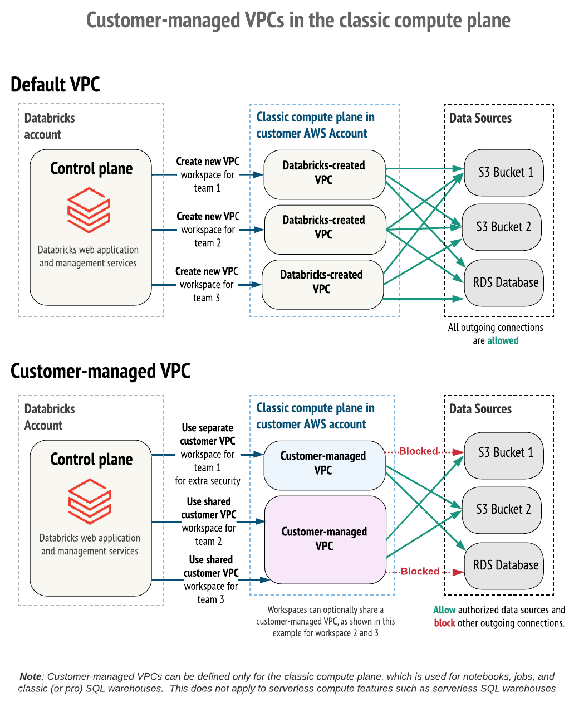
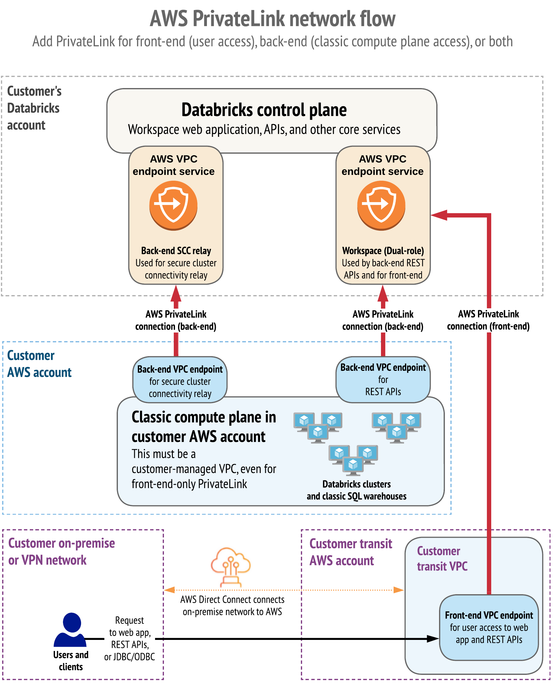

現状は主にクラシックコンピュートプレーンについて記載。

# 自身で用意したVPCを使う

Databricksの機能でワークスペース用のVPCを生成する事ができない事情がある場合には、ワークスペースを顧客が独自に用意したVPCで作成する機能がある。これは顧客管理VPCと呼ばれている (参考資料1)。

(参考資料2)


## メリット

顧客管理VPCには以下のメリットが挙げられる。

- 与える権限を更に制約 … マネージドVPCよりもDatabricksへ与える権限を少なく出来る
- ネットワーク運用を簡素化 … 別システムとVPCを同居する事でピアリング設定が省ける
- VPCを統合 … 複数ワークスペースでVPCを共有する事でインスタンス管理や請求が優位
- セキュリティを強化 … クラスターの通信の許可を必要最小限に制限可能

## 必要な設定

- IAM ロール … ワークスペース作成用ロールに顧客管理VPC向けがある (参考資料5)
- VPC … DNSホスト名とDNS解決を有効化
- Subnet (サブネット CIDR `/17～/26`)
  - パブリックサブネット1個 (NAT用)
  - プライベートサブネット2個 (クラスター起動用)
    - 各サブネットへ配置可能なノード数は使用可能なIPアドレスの半分 (ノードごとに 2 つの IP アドレス (管理トラフィック用と Apache Spark アプリケーション用) が割り当てられる)
  - プライベートサブネット1個 (エンドポイント設置用)
- セキュリティグループ (クラスターノード用)
  - クラスターのノードへは1～5個まで割当て可能
  - ワークスペースごとに定義する事を推奨
  - インバウンド
    - 許可 … プロトコル: TCP/UDP, ポート番号: any, 接続元: 同一セキュリティグループ (他クラスターノード)
  - アウトバウンド
    - 許可 … プロトコル: TCP/UDP, ポート番号: any, 接続先: 同一セキュリティグループ (他クラスターノード)
    - 許可 … プロトコル: TCP, ポート番号: 443, 接続先: 0.0.0.0/0
    - 許可 … プロトコル: TCP, ポート番号: 3306, 接続先: 0.0.0.0/0
    - 許可 … プロトコル: TCP, ポート番号: 6666, 接続先: 0.0.0.0/0
    - 許可 … プロトコル: TCP, ポート番号: 2443, 接続先: 0.0.0.0/0
    - 許可 … プロトコル: TCP, ポート番号: 8443～8451, 接続先: 0.0.0.0/0
- セキュリティグループ (エンドポイント用)
  - VPC内で一つ作りワークスペース間で共有
  - インバウンド
    - 許可 … プロトコル: TCP/UDP, ポート番号: any, 接続元: 同一セキュリティグループ
  - アウトバウンド
    - 許可 … プロトコル: TCP/UDP, ポート番号: any, 接続先: 同一セキュリティグループ
- ゲートウェイ
  - NAT GW … クラスターノード用のサブネットからインターネットへの経路が必要
  - Internet GW … NATからインターネットへの経路用に必要
- エンドポイント (任意だが設置推奨)
  - AWS サービス用エンドポイント … S3、STS、Kinesis Stream、(RDS)
  - RDS はエンドポイント非対応 (参考資料1)
    - hive metastore に必要であるため NAT 経路で手を打つ
  - エンドポイントの「DNS 名を有効にする」を行う
- Databricks のアカウント管理画面のクラウドリソース
  - ネットワーク設定 … クラスターノードが起動される VPC、サブネット、セキュリティグループを登録
    - VPC, サブネット ... 作成したものを指定
    - セキュリティグループ ... クラスターノード用とエンドポイント用の2つを指定
  - プライベートアクセス設定
    - パブリックアクセス ... True (インターネット側からのワークスペースアクセスを許可)
    - プライベートアクセスレベル ... アカウント (コントロールプレーンへのエンドポイントの有効化)

# AWS PrivateLinkを有効にする
PrivateLink を使うと、トラフィックをインターネットに公開することなく通信を行うことができる。これは顧客管理VPCでワークスペースを構築している場合に有効化できる (Databricks 管理 VPC の場合は不可。後から顧客管理 VPC へ変更することも不可) (参考資料3)。Databricks は以下2つの経路の PrivateLink をサポート。

- フロントエンド (ユーザとワークスペース間)
- バックエンド (コンピュートプレーンとコントロールプレーン間)

図を引用すると以下の通り。

(参考資料3)


## 必要な設定

- エンドポイント ... リージョンごとのエンドポイント名は (参考資料4) から得る
  - バックエンド … クラスターとコントロールプレーン間の通信用
    - scc-endpoint … セキュアなクラスター接続用
    - workspace-endpoint … Databricks の REST API による操作用
  - フロントエンド … ブラウザとDatabricks間の通信用
    - frontend-endpoint … Databricks の REST API による操作用
- セキュリティグループ
  - 顧客管理VPC内の他エンドポイントと同じものを使用
- DNS登録
  - ブラウザからワークスペースURLへアクセスする際の向き先をフロントエンド用エンドポイントへ変える (参考資料3)
    - 検証ではブラウザを動かすPCのhostsへエントリを追加 (参考資料1)
- Databricks アカウント管理画面のクラウドリソース
  - ネットワーク設定 … 顧客管理 VPC の設定に加えて以下を追加
    - バックエンドプライベート接続
      - セキュアなクラスター接続を中継するためのVPCエンドポイント ... scc-endpoint
      - REST API用のVPCエンドポイント ... workspace-endpoint
  - プライベートアクセス設定
    - パブリックアクセス ... False (インターネット側からワークスペースへアクセス不可にする)
    - プライベートアクセスレベル ... アカウント (VPCエンドポイントの登録全てを使用可能にする)
  - VPCエンドポイント … 作成したエンドポイントを登録

## 注意点

- workspace-endpoint、frontend-endpoint は同一VPC内に設置するならば1つにしても良い (参考資料3)
- 全てのエンドポイントは **「DNS 名を有効にする」** を行う必要有り
- NAT 排除は困難
  - Apache Hive metastore を使う際はクラスターとインターネット側にある Databricks が疎通する必要がある (参考資料3)
  - VPC 内部に外部 Apache Hive metastore を設置や AWS Glueを使うことも可能 (参考資料3)
    - [External Apache Hive metastore (legacy) | Databricks on AWS](https://docs.databricks.com/ja/archive/external-metastores/external-hive-metastore.html)
    - [Use AWS Glue Data Catalog as a metastore (legacy) | Databricks on AWS](https://docs.databricks.com/ja/archive/external-metastores/aws-glue-metastore.html)
  - NAT 無しかつ外部 Apache Hive metastore 無しの構成ではクラスターや SQL Warehouse、カタログが随所でタイムアウトするまでフリーズする現象が発生する

# ハンズオン
以下のリポジトリをローカルへ DL し、ターミナルで開く。  
https://github.com/namoshika/hello-databricks

## 顧客管理 VPC で閉域構築する
ワークスペースをインターネット側からアクセス不可にしたい場合には顧客管理 VPC で構成する事で可能。

**AWS 側を設定**

```bash
DATABRICKS_ACCOUNT_ID='...'
DATABRICKS_BUCKET_NAME_WORKSPACE='...'

# -------------------------------------
# ベーススタック (Customer Managed VPC)
# -------------------------------------
aws cloudformation deploy \
    --stack-name 'databricks-base-cmvpc' \
    --template-file 'cloudformation/databricks-base-cmvpc.cf.yaml' \
    --parameter-overrides DatabricksAccountId="$DATABRICKS_ACCOUNT_ID" \
    --capabilities CAPABILITY_NAMED_IAM

aws cloudformation deploy \
    --stack-name 'databricks-network-cmvpc' \
    --template-file 'cloudformation/databricks-network-cmvpc.cf.yaml' \
    --parameter-overrides DatabricksWorkspaceName="wk1" \
    --capabilities CAPABILITY_NAMED_IAM

# -------------------------------------
# ワークスペース
# -------------------------------------
aws cloudformation deploy \
    --stack-name 'databricks-storage-workspace' \
    --template-file 'cloudformation/databricks-storage-workspace.cf.yaml' \
    --parameter-overrides DatabricksAccountId="$DATABRICKS_ACCOUNT_ID" S3BucketName="$DATABRICKS_BUCKET_NAME_WORKSPACE" \
    --capabilities CAPABILITY_NAMED_IAM

# IAM Role を自己仮定型にするために再デプロイを行う
aws cloudformation deploy \
    --stack-name 'databricks-storage-workspace' \
    --template-file 'cloudformation/databricks-storage-workspace.cf.yaml' \
    --parameter-overrides DatabricksAccountId="$DATABRICKS_ACCOUNT_ID" S3BucketName="$DATABRICKS_BUCKET_NAME_WORKSPACE" IsFirstStep="False" \
    --capabilities CAPABILITY_NAMED_IAM
```

**Databricks 側を設定**  
Databricks のアカウント管理画面から「クラウドリソース」を開き、以下を設定。

* 資格情報の設定  
  CloudFormation の **databricks-base-cmvpc** スタックの出力を入力
  * 資格情報の設定名: **\[CredentialName\]**
  * ロールARN: **\[IAMRoleForCredential\]**
* ストレージ設定  
  CloudFormation の **databricks-storage-workspace** スタックの出力を入力
  * ストレージ設定名: (ワークスペース場所に使う S3 バケット名)
  * バケット名:  (ワークスペース場所に使う S3 バケット名)
  * IAMロールARN: **\[IamRoleDatabricksToS3Bucket\]**
* ネットワーク  
  CloudFormation の **databricks-network-cmvpc** スタックの出力を入力
  * VPCエンドポイント
    * VPCエンドポイント名: wk1-scc
      * リージョン: ap-northeast-1
      * AWS VPCエンドポイントID: **\[VPCEndpointScc\]**
    * VPCエンドポイント名: wk1-workspace
      * リージョン: ap-northeast-1
      * AWS VPCエンドポイントID: **\[VPCEndpointWorkspace\]**
    * VPCエンドポイント名: wk1-frontend
      * リージョン: ap-northeast-1
      * AWS VPCエンドポイントID: **\[VPCEndpointFrontend\]**
  * プライベートアクセス設定
    * プライベートアクセス設定名: wk1-pas
    * リージョン: ap-northeast-1
    * パブリックアクセス: False (ワークスペースをインターネット側へ公開するか否か)
    * プライベートアクセスレベル: アカウント
  * ネットワーク設定
    * ネットワーク設定名: wk1-vpc
    * VPC ID: **\[NetworkSettingsVpcId\]**
    * サブネットID:
      * **\[NetworkSettingSubnetA\]**
      * **\[NetworkSettingSubnetB\]**
    * セキュリティグループID:
      * **\[NetworkSettingSecurityGroup1\]**
      * **\[NetworkSettingSecurityGroup2\]**
    * セキュアなクラスター接続を中継するためのVPCエンドポイント: wk1-scc
    * REST API用のVPCエンドポイント: wk1-workspace

**ワークスペースを作成**  
管理画面から「ワークスペース」を開き、ワークスペースを「手動」で以下の設定の元で作成する。

* ワークスペース名: sample-workspace
* リージョン: ap-northeast-1
* ストレージ設定: (ワークスペース場所に使う S3 バケット名)
* 資格情報の設定: databricks-iamrole-base-cmvpc
* 高度な設定
  * ネットワーク構成: wk1-vpc
  * プライベートリンク: wk1-pas

# トラブルシュート

## クラスター起動に失敗する (ケース1)

SCCエンドポイントのDNS 名が有効したところ解決。

```
Npip Tunnel Setup Failure: NPIP tunnel setup failure during launch. Please try again later and contact Databricks if the problem persists. Instance bootstrap failed command: WaitForNgrokTunnel Failure message (may be truncated): Timed out waiting for ngrok tunnel to be up
```

## クラスター起動に失敗する (ケース2)

クラスター用サブネットからNATへの経路を削除した際に発生。全てのエンドポイントのDNS 名を有効したところ解決。STSとの通信がVPC内のエンドポイントを介さずインターネット上のエンドポイントと通信しており、NAT経路を遮断した事で発生したと思われる。

```
Failed to set up the Spark container due to an error when registering the container to security daemon
```

# 参考資料

1. [Databricks on AWSを閉域網で構成する #AWS - Qiita](https://qiita.com/RyoOkaya/items/f042829a019a7c35d7fc)
   - 全容を把握する上で日本語と図が読みやすく分かりやすい。
2. [顧客管理VPCの設定 | Databricks on AWS](https://docs.databricks.com/ja/security/network/classic/customer-managed-vpc.html#vpc-sizing)
   - PrivateLinkを使う場合でも顧客管理 VPC とは別件とし、顧客管理 VPC から始めると分かりやすい
3. [AWS PrivateLinkを有効にする | Databricks on AWS](https://docs.databricks.com/ja/security/network/classic/privatelink.html)
4. [Databricksのクラウドとリージョン | Databricks on AWS](https://docs.databricks.com/ja/resources/supported-regions.html#privatelink)
5. [ワークスペース展開用のIAMロールを作成する｜Databricks on AWS](https://docs.databricks.com/ja/administration-guide/account-settings-e2/credentials.html#cmvpc-default-restrictions)
