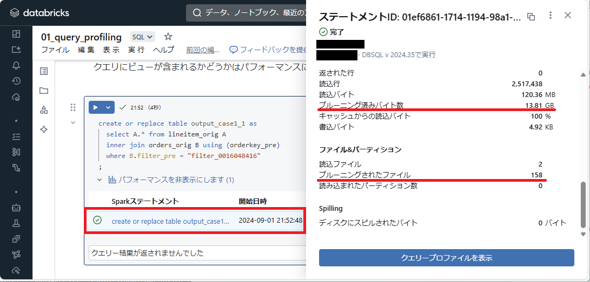
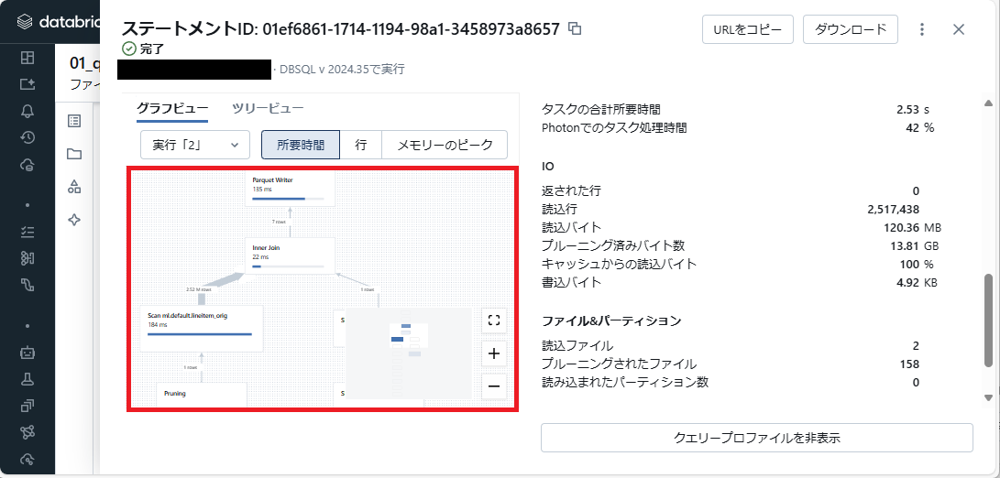

Spark でデータ処理を書いていて生じたクエリのパフォーマンス問題へ対処する過程で分かった事、見つけた Databricks の便利な機能を記載する。

# 効率的な処理の基本
Spark では巨大なデータセットを複数台のマシンで並列分散処理する事ができるが、効率的に行いたい場合には以下を心掛ける必要が有る。

* 必要なデータのみをロードさせる
* 処理中のデータのシャッフルを避ける

不要なデータを処理させないように作る事が基本となる。また、処理の中にはレコード同士を独立して処理できるものも有れば、レコード間で影響し合う処理も有る。 Spark では後者の処理を行う際にマシン間で処理中のデータをデータに応じて再配置する「シャッフル」が発生する。このシャッフルは非常に高コストな処理とされ、これを避ける事も効果が有る。

# 分析方法1: 実行計画を読む
パフォーマンスに問題が有る場合、Spark がクエリをどのように実行しようとしているか (実行計画) を知る事は対処を考える際の取っ掛かりとなる。これはお馴染みの EXPLAIN 文で取得可能。

```sql
-- EXPLAIN COST {Query}.
-- 論理プランと統計情報を見るために COST オプションを付与.
EXPLAIN COST
SELECT A.* FROM samples.tpch.lineitem A
INNER JOIN samples.tpch.orders B ON A.l_orderkey = B.o_orderkey
WHERE B.o_orderkey = 16048416
```

例えば上を実行すると以下のような出力が得られる。

```
plan
"== Optimized Logical Plan ==
Project [l_orderkey#9623L, l_partkey#9624L, l_suppkey#9625L, l_linenumber#9626, l_quantity#9627, l_extendedprice#9628, l_discount#9629, l_tax#9630, l_returnflag#9631, l_linestatus#9632, l_shipdate#9633, l_commitdate#9634, l_receiptdate#9635, l_shipinstruct#9636, l_shipmode#9637, l_comment#9638], Statistics(sizeInBytes=1669.0 TiB, ColumnStat: N/A)
+- Join Inner, (l_orderkey#9623L = o_orderkey#9639L), Statistics(sizeInBytes=1743.2 TiB, ColumnStat: N/A)
   :- Filter (isnotnull(l_orderkey#9623L) AND (l_orderkey#9623L = 16048416)), Statistics(sizeInBytes=735.4 MiB, ColumnStat: N/A)
   :  +- Relation samples.tpch.lineitem[l_orderkey#9623L,l_partkey#9624L,l_suppkey#9625L,l_linenumber#9626,l_quantity#9627,l_extendedprice#9628,l_discount#9629,l_tax#9630,l_returnflag#9631,l_linestatus#9632,l_shipdate#9633,l_commitdate#9634,l_receiptdate#9635,l_shipinstruct#9636,l_shipmode#9637,l_comment#9638] parquet, Statistics(sizeInBytes=735.4 MiB, ColumnStat: N/A)
   +- Project [o_orderkey#9639L], Statistics(sizeInBytes=36.3 MiB, ColumnStat: N/A)
      +- Filter (isnotnull(o_orderkey#9639L) AND (o_orderkey#9639L = 16048416)), Statistics(sizeInBytes=272.4 MiB, ColumnStat: N/A)
         +- Relation samples.tpch.orders[o_orderkey#9639L,o_custkey#9640L,o_orderstatus#9641,o_totalprice#9642,o_orderdate#9643,o_orderpriority#9644,o_clerk#9645,o_shippriority#9646,o_comment#9647] parquet, Statistics(sizeInBytes=272.4 MiB, ColumnStat: N/A)

== Physical Plan ==
AdaptiveSparkPlan isFinalPlan=false
+- ColumnarToRow
   +- PhotonResultStage
      +- PhotonProject [l_orderkey#9623L, l_partkey#9624L, l_suppkey#9625L, l_linenumber#9626, l_quantity#9627, l_extendedprice#9628, l_discount#9629, l_tax#9630, l_returnflag#9631, l_linestatus#9632, l_shipdate#9633, l_commitdate#9634, l_receiptdate#9635, l_shipinstruct#9636, l_shipmode#9637, l_comment#9638]
         +- PhotonShuffledHashJoin [l_orderkey#9623L], [o_orderkey#9639L], Inner, BuildRight
            :- PhotonShuffleExchangeSource
            :  +- PhotonShuffleMapStage
            :     +- PhotonShuffleExchangeSink hashpartitioning(l_orderkey#9623L, 16)
            :        +- PhotonScan parquet samples.tpch.lineitem[l_orderkey#9623L,l_partkey#9624L,l_suppkey#9625L,l_linenumber#9626,l_quantity#9627,l_extendedprice#9628,l_discount#9629,l_tax#9630,l_returnflag#9631,l_linestatus#9632,l_shipdate#9633,l_commitdate#9634,l_receiptdate#9635,l_shipinstruct#9636,l_shipmode#9637,l_comment#9638] DataFilters: [isnotnull(l_orderkey#9623L), (l_orderkey#9623L = 16048416)], DictionaryFilters: [(l_orderkey#9623L = 16048416)], Format: parquet, Location: PreparedDeltaFileIndex(1 paths)[dbfs:/databricks-datasets/tpch/delta-001/lineitem], PartitionFilters: [], ReadSchema: struct<l_orderkey:bigint,l_partkey:bigint,l_suppkey:bigint,l_linenumber:int,l_quantity:decimal(18..., RequiredDataFilters: [isnotnull(l_orderkey#9623L), (l_orderkey#9623L = 16048416)]
            +- PhotonShuffleExchangeSource
               +- PhotonShuffleMapStage
                  +- PhotonShuffleExchangeSink hashpartitioning(o_orderkey#9639L, 16)
                     +- PhotonScan parquet samples.tpch.orders[o_orderkey#9639L] DataFilters: [isnotnull(o_orderkey#9639L), (o_orderkey#9639L = 16048416)], DictionaryFilters: [(o_orderkey#9639L = 16048416)], Format: parquet, Location: PreparedDeltaFileIndex(1 paths)[dbfs:/databricks-datasets/tpch/delta-001/orders], PartitionFilters: [], ReadSchema: struct<o_orderkey:bigint>, RequiredDataFilters: [isnotnull(o_orderkey#9639L), (o_orderkey#9639L = 16048416)]

"
```

出力結果はクエリをツリー構造で表現したものとなる。Spark は SQL や DataFrame を以下の段階を経て RDD へ変換し実行する (参考資料1)。 EXPLAIN は Spark がクエリをどのように実行するのかを知る際に使える。

1. 構文解析された論理プラン (Parsed Logical Plan)
2. 意味解析された論理プラン (Analyzed Logical Plan)
3. 最適化された論理プラン (Optimized Logical Plan)
4. 物理プラン (Physical Plan)

このような実行計画において以下のノードには注意が必要となる。

* **Statistics(sizeInBytes=1743.2 TiB**:  
  論理プランにノードが扱うデータセットの予想サイズとして出力される。小さい程に不要なデータロードの回避が期待できる
* **Join LeftSemi**:  
  where 句の中でサブクエリによる絞込みをすると論理プランに現れる。記事執筆時の検証では両者に物理プランの差は無いが、 Join Inner (内部結合) に書き換える方が良いとする有識者も居る。
* **PhotonShuffledHashJoin**:  
  結合を行うと物理プランに現れてシャッフルを発生させる。結合の左右いずれかのデータセットサイズを小さく抑えられる場合 (閾値: `spark.sql.autoBroadcastJoinThreshold`. 既定 10MB. 参考資料2)  、Spark へ上手く伝達できるとより効率的な PhotonBroadcastHashJoin に取って代わらせることが出来る

# 分析方法2: クエリープロファイルを読む
Databricks では SQL Warehouse で実行したクエリからはグラフィカルなUIで情報を得る機能が有る。ノートブック上で分析対象のクエリを実行した場合には以下の箇所をクリックする事で開くことが可能。

得られる情報のうち、「プルーニング済みバイト数」や「プルーニングされたファイル」はテーブル参照時に読み込みをスキップできたサイズやファイル数となる。



また、「クエリープロファイルを表示」からは EXPLAIN と近い情報を得る事ができる。



クエリープロファイルにおいても EXPLAIN と同様の箇所に注意を向けることが可能。さらにノードをクリックすると右側が詳細に切り替わり、細かい情報を得ることができる。結合時のジョイン方法が確認可能である他、実行後に得られる情報 (処理時間、出力行数、最大消費メモリ量 etc) も読めるため、要改善箇所の特定ではより扱いやすい。

* **Scan:**  
  テーブル読込み箇所に現れる。詳細画面のうち、「Size of files pruned」項目が読込みスキップできたデータセットサイズを表し、スキップできるほど望ましい
* **～ Join:**  
  テーブル結合箇所に現れる。詳細画面のうち、「Join algorithm」項目がジョイン方法を表し、EXPLAIN の節で紹介した事柄と同様の事が確認可能

# クエリを最適化する
以上の方法で分析しクエリを修正した結果、効率的なクエリの実行計画を生成させるには以下の事が有効だった。基本的な事を積み重ねていくことになる。

1. 複雑なクエリを実行するテーブルには Delta Lake を使う
2. Delta Lake へは列単位の統計情報を付与する
3. Delta Lake へデータスキップ項目を設定する
4. パーティションよりもリキッドクラスター (場合により Z-order も) を使う
5. テーブル参照は View を介さず直接参照する
6. 絞込み条件に動的生成値を使わない
7. where 句のサブクエリ条件のうち、内部結合に置換可能なものは置換する

可能な限りデータセットは Databricks 側へ取り込んだ方が良い (既定で使用される Delta Lake はパフォーマンスをはじめメリットが多く有る)。また、以下のSQLでテーブルの統計情報は最新化できる。

```sql
-- (下のサンプルテーブルは読み取り専用のため実行するとエラーが出る. 読書き可能テーブルで行うこと)
ANALYZE TABLE samples.tpch.lineitem COMPUTE STATISTICS FOR ALL COLUMNS
```

Delta Lake で先頭32列より後ろの列をフィルタ条件に使う場合にはデータスキップ項目を手動設定する。

```sql
-- テーブル定義時に行う
CREATE TABLE sample_tbl (...) TBLPROPERTIES ('delta.dataSkippingStatsColumns' = 'col_a,`日本語も可能`');

-- テーブル定義後に行う
ALTER TABLE sample_tbl SET TBLPROPERTIES ('delta.dataSkippingStatsColumns' = 'col_a,`日本語も可能`');

-- alter で後から設定した場合には統計情報の再計算が必要
ANALYZE TABLE sample_tbl COMPUTE DELTA STATISTICS
```

絞込み条件で組み立てる値はテーブル列として事前に値を生成しておくことがお勧め。日付 (yyyy, mm, dd) を繋げる (yyyymmdd) などが考えられる。

```sql
-- Before
select * from samples.tpch.lineitem where lpad(l_orderkey, 10, "0") = "0016048416";

-- After (Prep)
create or replace table lineitem_2 as
select lpad(l_orderkey, 10, "0") as orderkey, * from samples.tpch.lineitem;

-- After (Query)
select * from lineitem_2 where orderkey = "0016048416";

```

絞込み条件のうち、内部結合で表現可能なものは実行計画を比較した上で最良の方法を選択すると良い。

```sql
-- Before
select A.* from samples.tpch.lineitem A
where A.l_orderkey in (select B.o_orderkey from samples.tpch.orders B where B.o_orderkey = 16048416)
;

-- After
select A.* from samples.tpch.lineitem A
inner join samples.tpch.orders B on A.l_orderkey = B.o_orderkey
where B.o_orderkey = 16048416
;
```

# 検証ノートブック
以下のリポジトリで以下の観点で検証を行った。ナイーブな気が... 実際の場面では Adaptive Query Execution である程度改善されるのではとも思っている。

ノートブック: [GitHub](https://github.com/namoshika/hello-databricks/blob/main/workspace/query_profiling_01.sql)  
実行環境: SQL Warehouse (DBSQL v2024.35)

## 1. View の影響
View から列の統計情報を取得できないのか (実行計画に ColumnStat: N/A が出る)、物理テーブルのみで構成されていたクエリに View が入り込むとブロードキャスト結合されていた箇所がシャッフルハッシュジョインになる。

| Case          | Table          | Time  | Read / Pruned file   | Physical plan           |
| ------------- | -------------- | ----- | -------------------- | ----------------------- |
| table - table | output_case1_1 | 4 sec | 120.36 MB / 13.81 GB | PhotonBroadcastHashJoin |
| table - view  | output_case1_2 | 6 sec | 10.45 GB / 4.33 GB   | PhotonShuffledHashJoin  |
| view - view   | output_case1_3 | 5 sec | 10.45 GB / 4.33 GB   | PhotonShuffledHashJoin  |

## 2. 絞り込み項目による影響
絞り込み条件に動的生成列を使うと不要データのロードがスキップされなくなる。ジョイン戦略も変わり、不要なシャッフルを誘発する (列に統計情報が無いために最適な実行計画が作成されない)

| 絞り込み | Table          | Time   | Read / Pruned file   | Physical plan           |
| -------- | -------------- | ------ | -------------------- | ----------------------- |
| 静的生成 | output_case2_1 | 14 sec | 120.21 MB / 13.81 GB | PhotonBroadcastHashJoin |
| 動的生成 | output_case2_2 | 17 sec | 10.89 GB / -         | PhotonShuffledHashJoin  |

## 3. 絞り込み方法による影響
サブクエリによる絞り込みを行うと Left Semi Join が発生する (Databricks 社の人曰く、遅くなる)。物理実行計画では通常の結合に変換されている。

| 絞り込み   | Table          | Time  | Read / Pruned file   | Physical plan           |
| ---------- | -------------- | ----- | -------------------- | ----------------------- |
| サブクエリ | output_case3_1 | 3 sec | 120.36 MB / 13.81 GB | PhotonBroadcastHashJoin |
| 内部結合   | output_case3_2 | 3 sec | 120.36 MB / 13.81 GB | PhotonShuffledHashJoin  |

# 参考資料

1. Deep Dive into Spark SQL's Catalyst Optimizer  
   https://www.databricks.com/blog/2015/04/13/deep-dive-into-spark-sqls-catalyst-optimizer.html
2. Performance Tuning  
   https://spark.apache.org/docs/latest/sql-performance-tuning.html
3. Adaptive Query Execution: Speeding Up Spark SQL at Runtime  
   https://www.databricks.com/blog/2020/05/29/adaptive-query-execution-speeding-up-spark-sql-at-runtime.html
