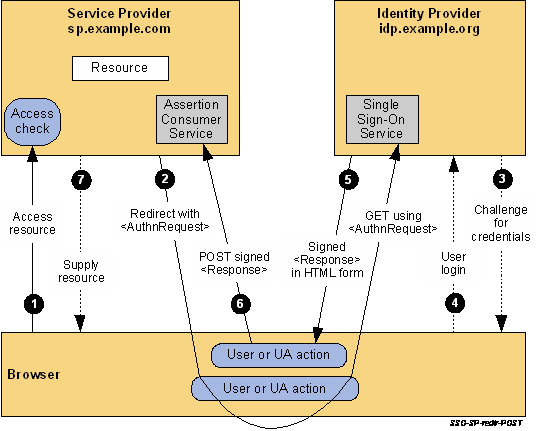

# ログイン1回でどこでも
TableauServerのSAML シングルサインオン (以下SSO) を構成してみます。これができると、認証基盤側で1度ログインすれば TableauServer やその他の SSO 対応アプリ間では二度とログイン画面を見なくて済みます。現実は中々そうはいきませんが、パスワード何回も入れるとか馬鹿らしいよね！ (どうせ同じパスワードだよ？)

記事の方針は以下とします。

* SAML SSO の概要を知る (細かい仕様には切り込みません。英語仕様書に心が折れた...)
* SSO構成を設定してみる (記事では認証基盤側にAzureADを使います)
* 上手くいかない時のチェックポイント (SSO初体験 & 実績無しIdPで苦戦したよ...(´；ω；｀)

# SAMLとは
SAML とは、OASIS3によって策定された異なるセキュリティドメイン間で認証情報を連携するための XML ベースな標準仕様です。

一般ユーザ向けには Twitter や Google による OAuth を用いた独自の実装が普及してますが、企業内で使用されるシステムの認証には標準化された SAML がよく用いられているようです (AD認証が広く使われてきましたが、クラウドサービスの時代はドメインをまたげるSAMLが多くなるんですかね)。

同じような技術を OAuth ベースに標準化したものとして OpenID Connect があるようですが、イマイチ流行ってないんじゃないかな。

## 登場する用語
ブラウザ SSO に関係する要素を列挙。 SOAP を使用できたり柔軟性があるようですが、ここではスルー。

| 用語         | 解説                                                                                                                                                           |
| ------------ | -------------------------------------------------------------------------------------------------------------------------------------------------------------- |
| Metadata     | SSOに必要なエンドポイントURLや証明書などを記述したXML。IdP、SPそれぞれが<br />生成でき、あると双方の設定が楽。中には `<EntityDescriptor>` が確認できる         |
| Binding      | アサーションをやり取りする際の方式。 HTTP-Redirect や HTTP-POST などがある                                                                                     |
| EntityID     | SP/IdP 間で共有する認識子                                                                                                                                      |
| Endpoint URL | SP/IdP 間でデータのやり取りに使われるURL。SPメタデータでは<br />`<md:AssertionConsumerService>` 、IdPメタデータでは<br /> `<SingleSignOnService>` で確認できる |

深堀りしていくと、以下の概念が登場してきます。

| 用語               | 解説                                                                                                                                                        |
| ------------------ | ----------------------------------------------------------------------------------------------------------------------------------------------------------- |
| Profile            | ユースケースにおけるバインディングやプロトコルのまとめ                                                                                                      |
| IdP / SP / Subject | IdPはユーザ認証の機能を提供する。SPは提供される認証情報を利用。認証される<br />対象 (ユーザ) はサブジェクトと表現される。まとめてパーティと呼ばれたりする。 |
| Assertion          | IdPが対象を証明するためにSPへ発行するデータ。中に `<Subject>` とそれに紐付く<br />0個以上のステートメントを持つ                                       |
| Statement          | アサーションの中に格納されているもの。 `<AttributeStatement>` 、<br /> `<AuthnStatement>` などが使われる                                                    |

SAML仕様書は以下から成ります。正確には SAML 2.0 です。  
https://wiki.oasis-open.org/security/FrontPage

| 仕様書   | 説明                                                      |
| -------- | --------------------------------------------------------- |
| Core     | SP/IdP 間でやり取りされる メッセージXML の仕様            |
| Binding  | メッセージやり取り方法の仕様。 ブラウザ上での動きはこの辺 |
| Profile  | 良く分からん。ここら辺で気力が...                         |
| Metadata | SP/IdP 間で信頼関係を設定する際に使う設定記述XMLの仕様    |

## 認証シーケンス
認証シーケンスを SP から始めるのか (SP-initiated) 、 IdP から始めるのか (IdP-initiated) で2種類あります。以下のシーケンスは SP-initiated の場合を記述しており、 IdP-initiated の場合は 3番から開始され、それ以降はほぼ同じです。

1. ユーザがブラウザで SP へアクセス
2. SP から IdP へリダイレクト。 (SPから `<saml2p:AuthnRequest>` が渡ります)
3. IdP がユーザへログインページを表示
4. ユーザがログインページへ認証情報を入力
5. IdP がユーザを適正と認証できたら、 SP へリダイレクト。  
6. ブラウザがIdPのレスポンスに従いSPへリダイレクト  
   (IdPから `<samlp:Response>` が渡ります。中に `<Assertion>` が含まれます)
7. SP はログイン後のページをユーザへ表示

  
[Copyright © OASIS Open 2008. All Rights Reserved](http://docs.oasis-open.org/security/saml/Post2.0/sstc-saml-tech-overview-2.0-cd-02.html#5.1.2.SP-Initiated%20SSO:%20%20Redirect/POST%20Bindings|outline)

# 必要なもの
SAML要件 ([参考資料1](https://onlinehelp.tableau.com/current/server/ja-jp/saml_requ.htm)) を熟読し、SP/IdPに必要な要素のチェックリストを作った方が良いです。

## 1. IdP 側
* テストユーザ
* SAML SP メタデータ ... TableauServer から持ってくる
* ADFS 属性の設定 ... 認証成功時に IdP から TableauServer へ username 属性を渡す設定が必要
* RelayState の設定 ... ログインには TableauServer から渡される RelayState を IdP は送り返せる必要有り

## 2. TableauServer 側
* IdPに登録されたテストユーザ ... アカウント自体は事前に作成が必要
* SAML IdP メタデータ ... IdP から持ってくる。TableauServer は POST binding のみ対応
* SAML 証明書 & 鍵 ... SPメタデータ経由でIdPへも渡る。シングルログアウトが要件になければIdPには必要なかったりする。

# やってみる
Azure AD で即席 IdP を作り、TableauServer へ設定してみます。
Azure AD には TableauServer への設定のチュートリアル ([参考資料2](https://docs.microsoft.com/ja-jp/azure/active-directory/saas-apps/tableauserver-tutorial)) があり、練習にはもってこいです。

## 1. TableauServerを構築

1. TableauServerを起動した仮想マシンを用意
2. ローカル認証でセットアップ  
   (アイデンティティストアは TableauServer が持つ必要があります。SAMLは認証を担いますが、認可は TableauServer が行うためです)
3. SSLを有効化  
   (Azure AD では SSL 無効の URL は登録できませんでした。記事ではSAMLを構成する際に作る証明書を使い回しました)

## 2. Tableau を構成 (1/2)
PowerShell を起動し、SAML認証時のTableauServer用証明書を発行します。
著者の場合、SSLで使い回すためにCSR発行時に CommonName として TableauServer のドメインを入れてます。

```powershell
$env:Path += ";C:\Program Files\Tableau\Tableau Server\packages\apache.20192.19.0718.1543\bin;"
$env:OPENSSL_CONF = "C:\Program Files\Tableau\Tableau Server\packages\apache.20192.19.0718.1543\conf\openssl.cnf"

openssl genrsa -out tabsrv.key 4096
openssl req -new -key tabsrv.key -x509 -days 365 -out tabsrv.crt -addext 'subjectAltName = IP:${アドレス(SSLのChromeエラー避け)}'
```

SAML認証の設定をします。

1. TSMを開き、\[Configuration\] - \[ユーザ認証とアクセス\] - \[認証方法\] を開く
2. 認証方法から「SAML」を選択
3. 「SAML認証を有効化」のチェックを入れる
4. 「Tableau Server リターン URL」へTableauServerのURLを入れる (ex: `https://domain`。末尾にスラッシュは付けないこと)
5. 「SAMLエンティティID」へIdPと共有する認識子を入れる (ex: `domain`。大抵はTableauServerのドメインを入れる)
6. Tableau Server 側のSAML用の証明書と鍵をアップロード
7. メタデータをダウンロード (まだ再起動は不要です)

## 3. IdP (Azure AD) を構成
既定ディレクトリへログイン用のユーザを作成。ここでは hoge ユーザを作ります。

1. Azure Portal から Azure Active Directory を開く
2. 既定ディレクトリから「ユーザ」を開き、「新しいユーザー」をクリック
3. 割り当ての追加から「ユーザー」を選択。
4. 「名前」に hoge、「ユーザ名」に hoge@domain (domain部分はAzureADの既定ディレクトリの「概要」から確認できます) を入力
5. パスワードを控えておく
6. 「作成」をクリック

エンタープライズアプリケーションを追加します。  

1. Azure AD から「エンタープライズアプリケーション」を開き「新しいアプリケーション」をクリック
2. ギャラリーから"Tableau Server"を検索し、追加をクリック

追加されたTableauServerへシングル サインオンを設定。

1. Azure AD のエンタープライズアプリから Tableau Server を開く
2. シングル サインオン をクリックし、SAMLを選択
3. 「メタデータ ファイルをアップロードする」をクリックし、TableauServer からダウンロードしたメタデータをアップロード
4. 「サインオン URL」に TableauServer のURLを入力
5. 「保存」をクリック

ユーザー属性とクレームから username 属性の付与を設定。  

1. ユーザー属性とクレームを編集し、「新しいクレームの追加」を押す
2. 「名前」に "username" 、「ソース」に「属性」を選択、「ソース属性」に "user.userprincipalname" を入力
3. 「保存」をクリック

IdPのメタデータをダウンロード。
SAML 署名証明書から「フェデレーション メタデータ XML」をクリックします。

## 4. Tableau を構成 (2/2)
TableauServer へ Azure AD で作成したユーザを追加します。

1. TableauServer へ管理者としてログイン
2. \[ユーザー\] を開き、 \[+ユーザの追加\] を押し、 \[新規ユーザー\] をクリック
3. 「ユーザー名」に Azure AD で作成したユーザーのID (ex: hoge@domain) を入力。その他は適当に埋める
4. 「ユーザーの追加」をクリック

TableauServer へ IdP の設定を入力

1. TSMを開き、\[Configuration\] - \[ユーザ認証とアクセス\] - \[認証方法\] を開く
2. 「SAML IdP metadata file」から IdP で発行したメタデータXMLをアップロード
3. 「Save Pending Changes」をクリック (まだ再起動は不要です)

## 5. 動作チェック
ブラウザ、Desktop, Mobileでチェック。
ブラウザでの認証はシークレットモードを推奨。認証に失敗してもブラウザを開き直せばやり直せて楽です。

* ログインができること
* ワークブックを開けること
* ログアウトができること (要件になかったりとスルー可能な事が多い)

# ログインに成功しない時には
デバッグ用にSAML認証のやり取りを覗く拡張機能を入れたChromeもインストールすると便利です (著者は [SAML DevTools extension](https://chrome.google.com/webstore/detail/saml-devtools-extension/jndllhgbinhiiddokbeoeepbppdnhhio) を使用)。

認証はvizportalで行われてます。 vizportal ログレベルを debug へ変更するとログ出力場所 (`C:\ProgramData\Tableau\Tableau Server\data\tabsvc\logs\vizportal\vizportal_node1-0.log`) にSAML認証の詳細が書き出されるようになり、SP側エラーについてはかなり分かります。

```powershell
# vizportal のログレベルを debug に設定
tsm configuration set -k vizportal.log.level -v debug

# 保留中の変更を列挙
tsm pending-changes list

# TableauServer を再起動
tsm restart

# 設定を既定値へ戻す (デバッグが済んだら設定を戻しましょう)
# tsm configuration set -k vizportal.log.level -d
```

## ログインに失敗する1
IdP の SAML Response に username 属性が無い場合には以下のログが残ります。

```log
2019-07-28 02:06:14.095 +0000 (,,,,) catalina-exec-1 : ERROR com.tableausoftware.saml.SAMLExtendedProcessingFilter - SAML Authentication Failed, please contact the administrator.
org.springframework.security.authentication.AuthenticationServiceException: Incoming SAML message has no valid value for username attribute. Please verify ServiceProvider configuration in Identity Provider.
	at com.tableausoftware.saml.SAMLExtendedProcessingFilter.getUser(SAMLExtendedProcessingFilter.java:507)
	at com.tableausoftware.saml.SAMLExtendedProcessingFilter.handleSuccess(SAMLExtendedProcessingFilter.java:255)
	at com.tableausoftware.saml.SAMLExtendedProcessingFilter.attemptAuthentication(SAMLExtendedProcessingFilter.java:219)
```

## ログインに失敗する2
IdP のエンドポイントURLに POST-Binding 用が無い場合 (HTTP-Redirectのみなど) には以下のエラーが記録されます。POST-Binding を IdP が処理できるよう設定した上で IdP メタデータを再発行し　TableauServer へ取り込んでください。

```log
2019-01-23 01:23:45.678 +0000 (,,,,) catalina-exec-2 : DEBUG com.tableausoftware.saml.SAMLExtendedContextProvider - SAML request parsed as scheme=foo, serverName=hogehoge, serverPort=foo, contextPath=/wg, requestURI=/wg/saml, requestURL=http://hogehoge/wg/saml, isSecure=foo
2019-01-23 01:23:45.678 +0000 (,,,,) catalina-exec-2 : DEBUG org.springframework.security.saml.context.SAMLContextProviderImpl - No IDP specified, using default https://idp.hoge.co.jp
2019-01-23 01:23:45.678 +0000 (,,,,) catalina-exec-2 : DEBUG com.tableausoftware.core.util.ApplicationContextHolder - Retrieving bean class com.tableausoftware.core.configuration.ConfigurationSupportService for bean type class com.tableausoftware.core.configuration.ConfigurationSupportService
2019-01-23 01:23:45.678 +0000 (,,,,) catalina-exec-2 : DEBUG com.tableausoftware.saml.SAMLExtendedEntryPoint - Adding relay state to request, relaystate: [dest=%2F&sendPodInfo=false&authSetting=&siteLuid=&embedded=false]
2019-01-23 01:23:45.678 +0000 (,,,,) catalina-exec-2 : DEBUG org.springframework.security.saml.util.SAMLUtil - Index for AssertionConsumerService not specified, returning default
2019-01-23 01:23:45.678 +0000 (,,,,) catalina-exec-2 : DEBUG org.springframework.security.saml.SAMLEntryPoint - Processing SSO using WebSSO profile
2019-01-23 01:23:45.678 +0000 (,,,,) catalina-exec-2 : DEBUG org.springframework.security.saml.SAMLEntryPoint - Error initializing entry point
org.opensaml.saml2.metadata.provider.MetadataProviderException: User specified binding urn:oasis:names:tc:SAML:2.0:bindings:HTTP-POST is not supported by the IDP using profile urn:oasis:names:tc:SAML:2.0:profiles:SSO:browser
	at org.springframework.security.saml.websso.WebSSOProfileImpl.getSingleSignOnService(WebSSOProfileImpl.java:147)
	at org.springframework.security.saml.websso.WebSSOProfileImpl.sendAuthenticationRequest(WebSSOProfileImpl.java:87)
	at org.springframework.security.saml.SAMLEntryPoint.initializeSSO(SAMLEntryPoint.java:226)
	at org.springframework.security.saml.SAMLEntryPoint.commence(SAMLEntryPoint.java:153)
    ...
```

## ログインに失敗する3
IdP/SP 間で設定に不整合がある場合には以下のエラーが記録されます。IdP/SP の設定を再確認してください。著者の場合、エンティティIDが不一致の際に出力されていました。

```log
2019-01-23 01:23:45.678 +0000 (,,,,) catalina-exec-3 : DEBUG com.tableausoftware.saml.SAMLExtendedContextProvider - SAML request parsed as scheme=https, serverName=hogehoge, serverPort=foo, contextPath=/wg, requestURI=/wg/saml/SSO/index.html, requestURL=https://hogehoge/wg/saml/SSO/index.html, isSecure=true
2019-01-23 01:23:45.678 +0000 (,,,,) catalina-exec-3 : DEBUG org.springframework.security.saml.processor.SAMLProcessorImpl - Retrieving message using binding urn:oasis:names:tc:SAML:2.0:bindings:HTTP-POST
2019-01-23 01:23:45.678 +0000 (,,,,) catalina-exec-3 : DEBUG org.springframework.security.saml.util.SAMLUtil - Found endpoint org.opensaml.saml2.metadata.impl.AssertionConsumerServiceImpl@abcdefg for request URL https://hogehoge/wg/saml/SSO/index.html based on location attribute in metadata
2019-01-23 01:23:45.678 +0000 (,,,,) catalina-exec-3 : DEBUG com.tableausoftware.saml.SamlWebSSOProfileConsumer - Verifying issuer of the Response
2019-01-23 01:23:45.678 +0000 (,,,,) catalina-exec-3 : DEBUG com.tableausoftware.saml.SamlWebSSOProfileConsumer - Verifying signature
2019-01-23 01:23:45.678 +0000 (,,,,) catalina-exec-3 : DEBUG org.springframework.security.saml.trust.MetadataCredentialResolver - Added 1 credentials resolved from metadata of entity https://idp.hoge.co.jp
2019-01-23 01:23:45.678 +0000 (,,,,) catalina-exec-3 : DEBUG com.tableausoftware.saml.SamlWebSSOProfileConsumer - Processing Bearer subject confirmation
2019-01-23 01:23:45.678 +0000 (,,,,) catalina-exec-3 : DEBUG com.tableausoftware.saml.SamlWebSSOProfileConsumer - Intended destination https://hogehoge/wg/saml/SSO/index.html matches the endpoint URLhttps://hogehoge/wg/saml/SSO/index.html
2019-01-23 01:23:45.678 +0000 (,,,,) catalina-exec-3 : DEBUG com.tableausoftware.saml.SamlWebSSOProfileConsumer - Validation of authentication statement in assertion failed, skipping
org.opensaml.common.SAMLException: Our entity is not the intended audience of the assertion
	at com.tableausoftware.saml.SamlWebSSOProfileConsumer.verifyAudience(SamlWebSSOProfileConsumer.java:161)
	at com.tableausoftware.saml.SamlWebSSOProfileConsumer.verifyAssertionConditions(SamlWebSSOProfileConsumer.java:117)
	at org.springframework.security.saml.websso.WebSSOProfileConsumerImpl.verifyAssertion(WebSSOProfileConsumerImpl.java:303)
	at org.springframework.security.saml.websso.WebSSOProfileConsumerImpl.processAuthenticationResponse(WebSSOProfileConsumerImpl.java:214)
    ...
```

## ログアウトが成功しない
IdP のシングルログアウト用のエンドポイントURLに POST-Binding 用が無い場合 (HTTP-Redirectのみなど) には以下のエラーが記録されます。シングルログアウト用のエンドポイントURLをIdP側に設定し、IdPメタデータ再発行と TableauServer への取込みを行ってください。

```log
2019-01-23 01:23:45.678 +0000 (,,,,) catalina-exec-2 : DEBUG com.tableausoftware.core.util.ApplicationContextHolder - Retrieving bean class org.springframework.security.saml.metadata.CachingMetadataManager for bean type class org.springframework.security.saml.metadata.MetadataManager
2019-01-23 01:23:45.678 +0000 (,,,,) catalina-exec-2 : ERROR com.tableausoftware.saml.SecurityContextPopulatingFilter - Unable to get the SAMLCredential. Proceeding without populating the SecurityContext.
java.lang.UnsupportedOperationException: The IDP and SP metadata files do not support a common single logout binding. IDP bindings: . SP bindings: urn:oasis:names:tc:SAML:2.0:bindings:HTTP-POST.
	at com.tableausoftware.saml.SAMLUtils.getServerLevelDefaultIdpLogoutBinding(SAMLUtils.java:73)
	at com.tableausoftware.saml.SecurityContextPopulatingFilter.doFilter(SecurityContextPopulatingFilter.java:54)
	at org.springframework.security.web.FilterChainProxy$VirtualFilterChain.doFilter(FilterChainProxy.java:342)
	at org.springframework.security.web.FilterChainProxy.doFilterInternal(FilterChainProxy.java:192)
    ...
```

## アプリからのログインが完了しない
アプリのログイン画面に TableauServer のトップページが表示されるのみで、認証が正常に完了しないことがあります。これはIdP が SP から渡された RelayState を認証成功時に送り返さない場合に発生します。その場合には IdP を RelayState が正しく扱われるよう設定してください。

# 参考資料

1. Tableau Server SAML要件  
   https://onlinehelp.tableau.com/current/server/ja-jp/saml_requ.htm
2. チュートリアル: Azure Active Directory と Tableau Server の統合  
   https://docs.microsoft.com/ja-jp/azure/active-directory/saas-apps/tableauserver-tutorial
3. Security Assertion Markup Language (SAML) V2.0 Technical Overview  
   http://docs.oasis-open.org/security/saml/Post2.0/sstc-saml-tech-overview-2.0-cd-02.html
4. SAML Wiki  
   https://wiki.oasis-open.org/security/FrontPage
