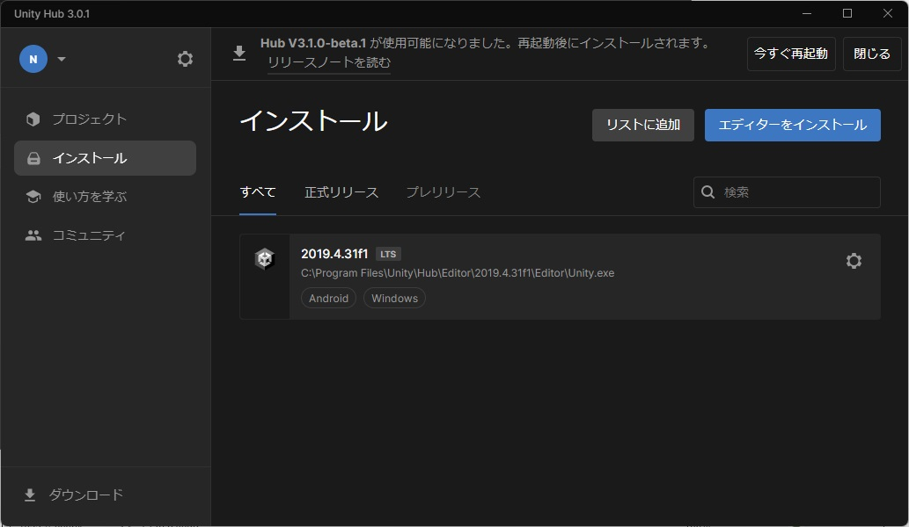
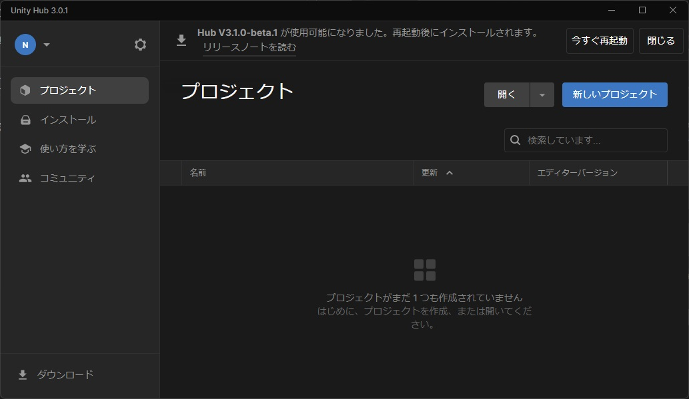
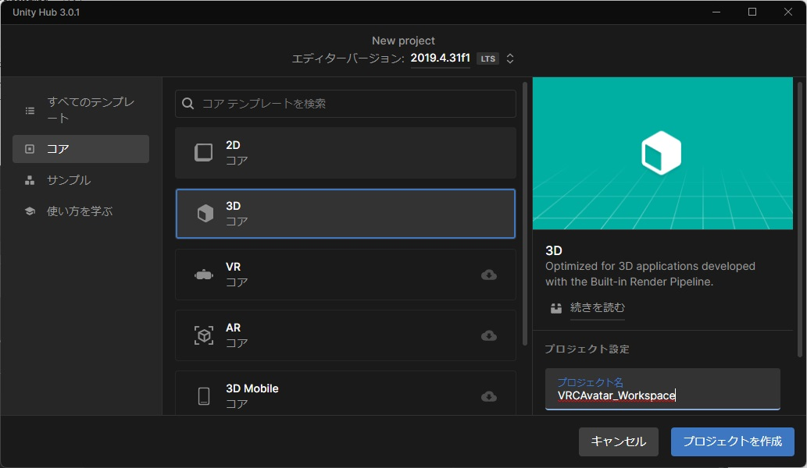
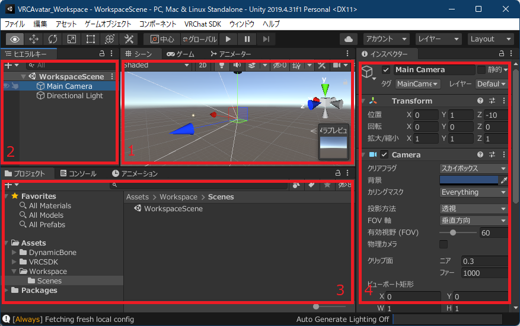
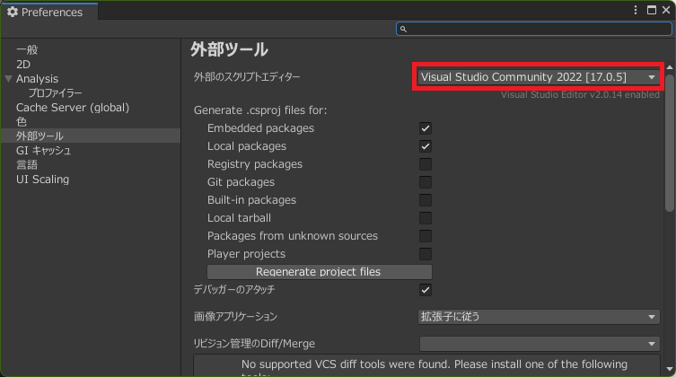
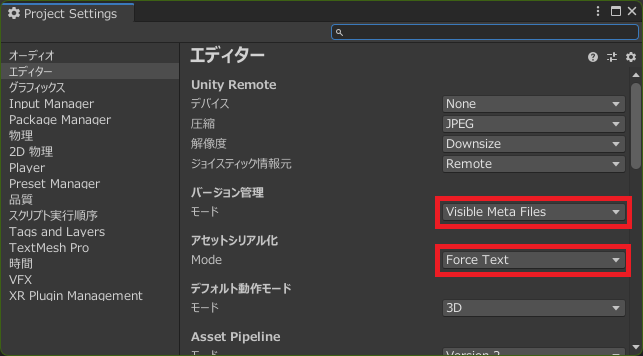
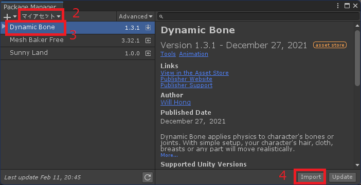
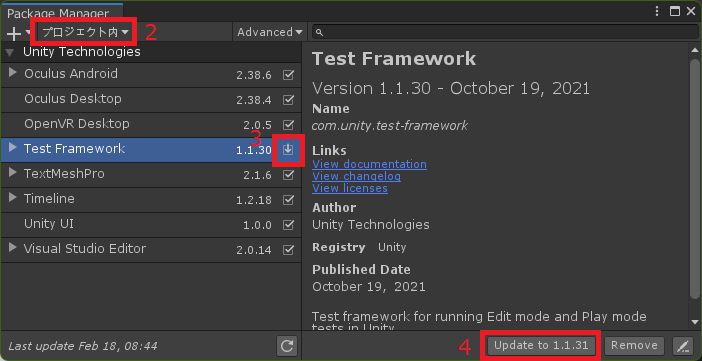

# 作業環境の方針
標準構成として以下のツールを導入します。

* Unity Hub
* Unity
* DynamicBone
* VRChat SDK
* Blender
* Git

ディレクトリ構造の方針は以下の通り。

```
VRCAvatar_Workspace                ... プロジェクト名
┣ Assets
┃ ┣ Asset01                      ... DL したアセットは Assets 直下に置く
┃ ┃ ┗ some_file
┃ ┗ Workspace
┃ 　 ┣ Scenes
┃ 　 ┃ ┣ {AvatarName}           ... 作業用シーン (PC)
┃ 　 ┃ ┗ {AvatarName}_android   ... 作業用シーン (Android)
┃ 　 ┣ Asset01
┃ 　 ┃ ┗ some_file_mod          ... 改変分は Workspace へ配置。ディレクトリ構造は原本の構造を踏襲
┃ 　 ┗ Asset02                   ... 新規分は Workspace へ配置
┣ Library/
┣ Packages/
┣ ProjectSettings/
┃
...
┗ VRCAvatar_Workspace.sln
```

# 必要ツールをインストールする

## 1. Unity Hub
[公式サイト](https://unity.com/download) から `UnityHubSetup.exe` をダウンロード。起動してウィザードに従いインストール。インストールが完了したら Unity Hub 起動はせずに閉じます。

(起動した場合、最新の LTS 版 Unity をインストールをしようとしてきます。 VRChat で使用されている Unity バージョンとは異なるため、 インストールせずに閉じてください)

## 2. Unity 本体
[公式ドキュメント](https://docs.vrchat.com/docs/current-unity-version) を開き、VRChat クライアントで使用されている Unity バージョンを調べて PC へインストールします。公式ドキュメントには対応バージョンを Unity Hub でインストールできるリンクがあります。インストール時には追加で以下のモジュールもインストールしてください。

* Microsoft Visual Studio Community (未インストールであればチェックオン)
* Android Build Support 配下 (Meta Quest2 への対応に必要)
* 言語パック 日本語 (開発環境が日本語化される)

インストールが完了すると、 Unity Hub のインストール一覧に表示されるようになります。



## 3. その他
以下のツールの最新版をインストール。

* Blender ... 無料モデリングソフト
* Git ... バージョン管理システム。アバター改変失敗時の巻き戻しが行いやすくなります。

# 作業用プロジェクトを作る
## 1. プロジェクトの作成
Unity Hub を起動しプロジェクトを生成します。

* テンプレート: 3Dコア
* プロジェクト名: VRCAvatar_Workspace (任意の名前でも良し)




## 2. 編集画面の説明
プロジェクトを作成するとソース保存ディレクトリに VRCAvatar_Workspace フォルダが作成された後、 Editor が起動します。Editor は幾つかのウィンドウから成りますが、以下のウィンドウが良く使用されます。アバターの着せ替えやアップロードはシーンに配置するものに対して行う形になります。

1. シーンビュー ... 編集中のシーンが表示される
2. ヒエラルキーウィンドウ ... 現在のシーンにあるゲームオブジェクト。
3. プロジェクトウィンドウ ... プロジェクトに属するアセット
4. インスペクターウィンドウ ... 選択されているオブジェクトに関する詳細情報

以下の画面では `Assets/Workspace/Scenes` 配下にあるシーン `WorkspaceScene` が編集中になっており、ヒエラルキーやシーンに表示された状態です。



## 3. 環境設定
以下の作業は1回行えば全てのプロジェクトで設定が共有されます。  

**外部ツール設定**  
Editor のメニューの `[編集]-[環境設定]` を開き、 `外部ツール` セクションを選択。 `外部スクリプトエディター` を `Visual Studio Community` にします。



**バージョン管理用設定**  
Editor のメニューの `[編集]-[プロジェクト設定]` を開き、 `エディター` セクションを選択。表示される設定項目のうち、以下項目を画像のように設定。

* バージョン管理 ... Meta ファイルを可視状態にします
* アセットのシリアル化 ... シーンやマテリアル、プレハブなどをテキストフォーマットで扱います



## 4. ディレクトリ構成
アセット類を格納するディレクトリ構造を以下の様にする。  

```
Assets
┗ Workspace
　 ┗ Scenes
```

## 5. Git リポジトリ化
プロジェクトディレクトリ直下をコンソールで開き、以下コマンドでリポジトリ作成 & 初回コミット。この時、リポジトリ固有設定で `core.autocrlf` を `false` にする事で、改行コードの自動変換を無効化してます。

```powershell
PS> Invoke-WebRequest "https://www.toptal.com/developers/gitignore/api/Unity" -OutFile ".gitignore"
PS> git init
PS> git config --local core.autocrlf false
PS> git add -A
PS> git commit -m 'initial commit'
```

## 6. VRChat SDK 追加
アバターアップロード用

1. `SDK3 - Avatars` を DL (https://vrchat.com/home/download)
2. DL した unitypackage ファイルをインポート (Editor 画面へ Drag&Drop)

## 7. Dynamic Bone 追加
揺れモノ用

1. Editor メニュー `[ウィンドウ]-[Package Manager]` を開く
2. マイアセット一覧を表示
3. Dynamic Bone を選択
4. アセットをインポート



## 8. 開発環境をコミット

```powershell
PS> git add -A
PS> git commit -m 'Build up editing environment'
```

# 環境の定期メンテ
## Package の更新
プロジェクトが参照しているパッケージはしばしば新バージョンがリリースされます。必要に応じてアップデートします。

1. Editor メニュー `[ウィンドウ]-[Package Manager]` を開く
2. プロジェクトに読み込まれたパッケージ一覧を表示
3. 新バージョンが出ているパッケージを選択
4. パッケージをアップデート



# 参考資料
* The VRChat Documentation Hub  
  https://docs.vrchat.com/