# アバターの用意
アバターは [BOOTH](https://booth.pm/) などで販売されています。ここでは "火事屋" さんが無料配布している "U10H7500" をサンプルに VRChat へのアバターアップロードを行います。

ここでは潰しが効く様にするため冗長な手順で進めますが、多くの場合は設定済みのプレハブが提供されています。その場合はどの作業が省略されるのか意識しながら進めてください。

## 1. モデルをインポートする
"U10H7500 Ver1.01" を DL し、 unitypackage をインポートします。  
(プロジェクトウィンドウの Assets 直下へ Drag&Drop。 zip の場合は解凍した上で行う)  
https://booth.pm/ja/items/2406667

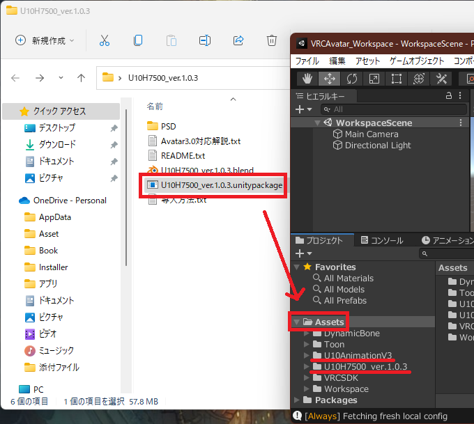

`*.unitypackage` ファイルが無い場合はディレクトリごと Assets 配下に入れる場合もあります。多くのアバターはインポート手順がテキストファイルや BOOTH の説明ページに記載されています。これに従いインポートしてください。 

## 2. 依存アセットを取得する
一部のアバターは追加で依存アセットを取得する必要があり、必要に応じて取得してください。  
ここではあえて "U10H7500" 描画時のシェーダーを変更します (`Standard` → `lilToon`) 。

以下の場所から lilToon を DL し、インポートします。  
https://booth.pm/ja/items/3087170

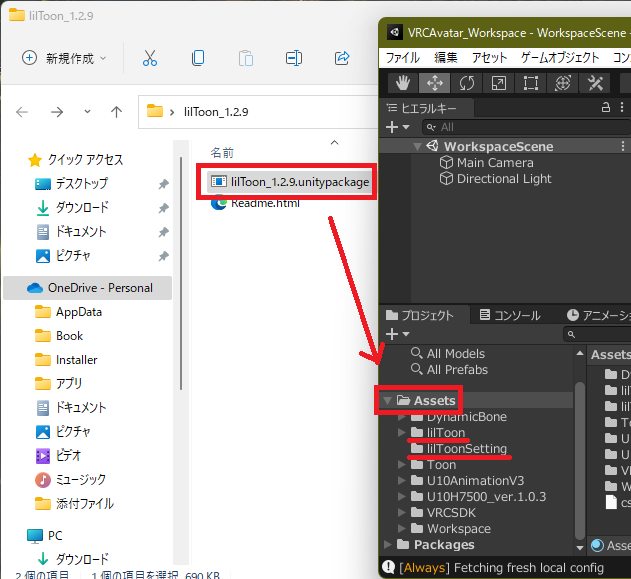

## 3. Unity アバターの設定

1. アセット配下の FBX を選択  
   (プロジェクトウィンドウの Assets の `U10H7500.mini_ver.1.0.3` を選択)
2. FBXの Rig を設定  
   Unity にモデルを アバターとして認識させます。
   * アニメーション ... ヒューマノイド
   * アバターの定義 ... このモデルから作成  
     これを行うと、ヒエラルキーに配置された FBX モデルへ Animator が追加されるようになります。
   * 設定 ... ヒューマノイドのボーン構造とモデルのボーンを対応付け。  
3. FBX の Model を設定
   * メッシュの `読み込み/書き込み有効` ... チェックオン。モデルのポリゴン数のカウントで必要
   * ジオメトリの `非推奨のブレンドシェイプの法線` ... チェックオン。理由不明

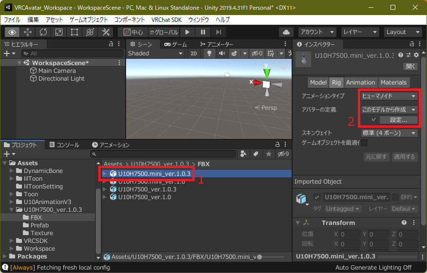
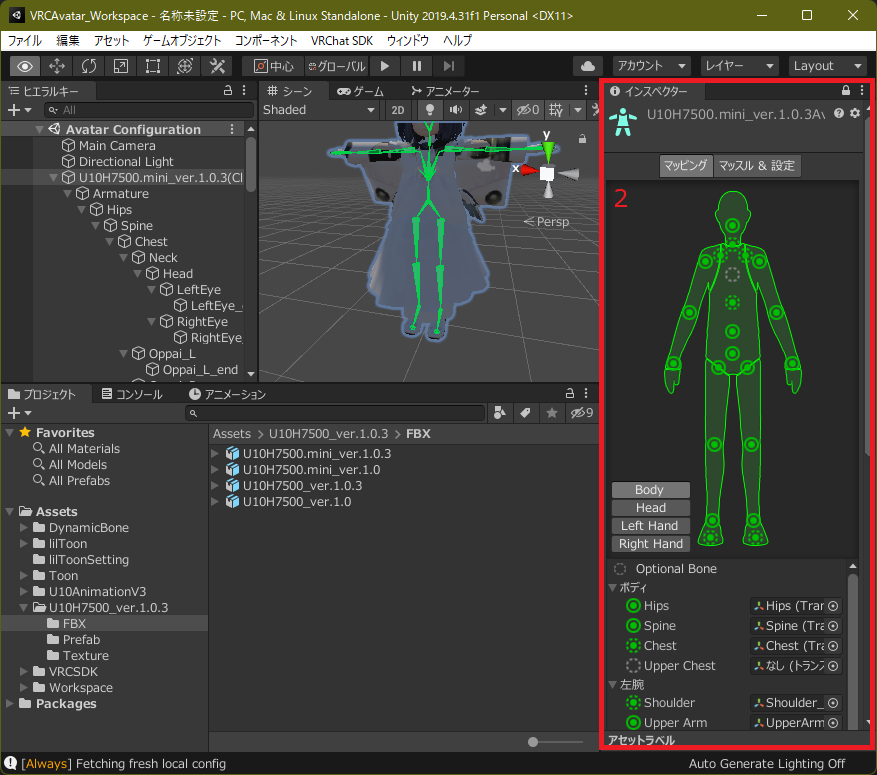
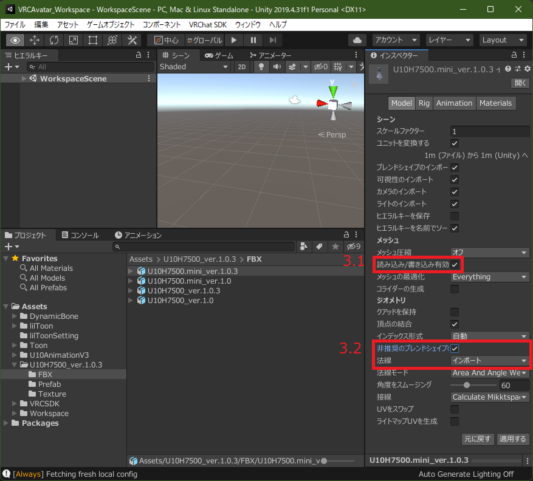

## 4. 作業用シーンを作成する
プロジェクトウィンドウで Assets の Scenes 配下に作業用のシーンを作成します。  
(Scenes ディレクトリを右クリックし、 `[作成]-[シーン]` をクリック)

ファイル名にアバター名、 Android 用には更に `_android` を付けます。

* U10H7500
* U10H7500_android

## 5. モデルをシーンへ配置する
Assets からアバターモデルを シーン `U10H7500` へ配置します。

1. シーン `U10H7500` を開いてヒエラルキーへ `U10H7500.mini_ver.1.0.3.fbx` を Drag&Drop  
2. シーンビューへモデルが表示された事を確認
3. ヒエラルキーへ配置されたモデルの位置を調整  
   (他のアバターが有る場合に邪魔にならないよう位置を調整)
   1. ヒエラルキーへ配置されたモデルを選択
   2. 移動ツールを選択
   3. 移動させたい方向の軸を Drag&Drop  
      (移動させるとモデルの Transform の値が変化します)

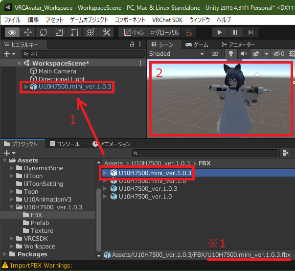
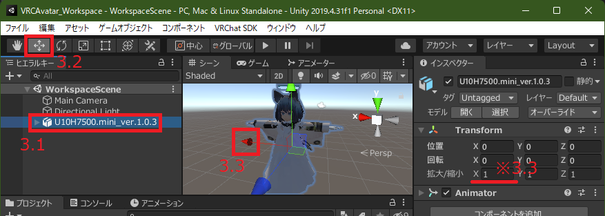

## 6. アバターを改造する
必要に応じて改造を行います。この時に素材は直接編集せず、 Workspace へコピーして編集してください。

ここでは不要箇所の削除とシェーダー変更 (`Standard` → `lilToon`) をしてみます。

1. 改変するアバターを選択  
   (ヒエラルキーの `U10H7500.mini_ver.1.0.3` を選択)
2. 編集可能な状態に切換え  
   (右クリックし、 `プレハブを解凍` をクリック)
3. 必要無い箇所を削除  
   (このアバターの FBX は全部入りであるため、不要なパーツを選択し、右クリックから削除)
4. 改変する箇所を選択  
   (ヒエラルキーの `U10H7500.mini_ver.1.0.3` の `Body.U10H7500mini.longonepice` を選択)
5. 改変する箇所のマテリアルを特定し選択  
   (インスペクターのマテリアルを選択するとアセット側で素材がハイライトされます。これを選択)
6. マテリアルを複製  
   (Ctrl+D で複製し `Assets/Workspace/U10H7500_ver.1.0.3/Texture` へ配置)
7. 改変するオブジェクトのマテリアルへ複製マテリアルを指定  
   (ヒエラルキーの `U10H7500.mini_ver.1.0.3` 配下のオブジェクトのマテリアルをインスペクターから個別変更)
8. 複製マテリアルを編集  
   (シェーダーを `Standard` から `liltoon` へ変更)
9. 複製マテリアルのメインカラーで指定されているテクスチャのストリーミングミニマップを有効化  
   (特に改変テクスチャを追加した場合に忘れず行ってください。今回も未設定状態故、有効化してください)

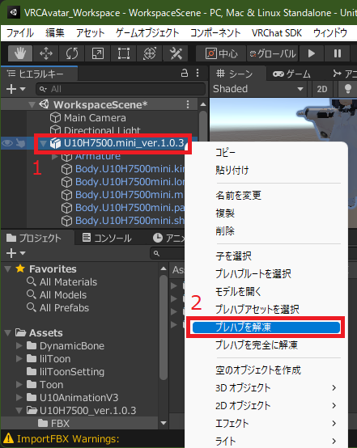
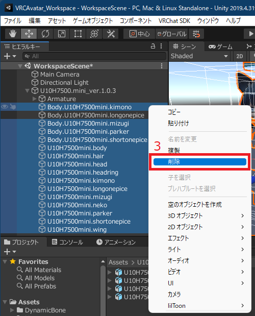
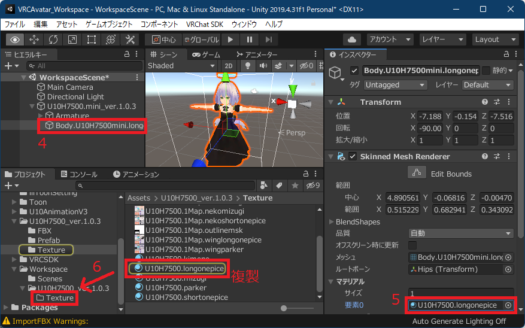
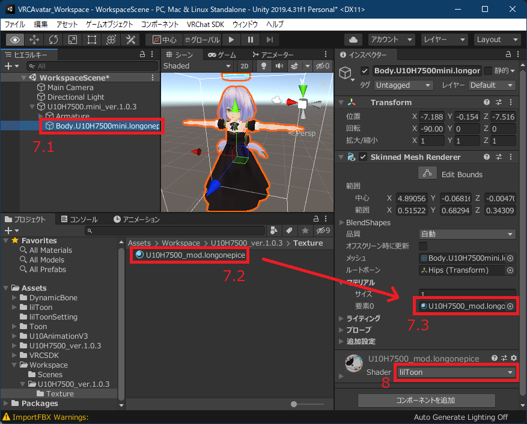
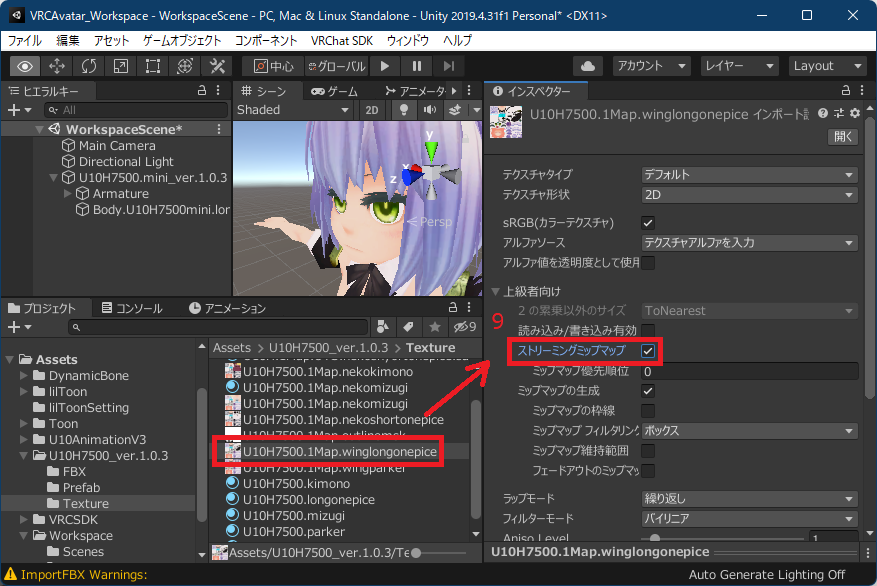

## 7. VRChat 用の情報を追加
VRChat 用のメタデータを定義します。ヒエラルキーのモデルを選択し、モデルへ `VRC Avatar Descriptor` コンポーネントを追加。 VRChat 用の設定を行います。

* View Position ... 視界カメラの場所を指定  
  Edit を押すと球体が表示される。球体の場所を目と目の間のメッシュ直下に設置
* Lip Sync ... 口を動かす際の方法を指定  
  ("U10H7500" では Mode に `Viseme Blend Shape`、 Face Mesh に `Body.U10H7500mini.longonepice`、Viseme:\* に `*_lip` を指定)
  * Jaw Flap Bone ... 発音する際に指定した1ボーンを動かす
  * Viseme Blend Shape ... 発音から唇を表現するモード
* Playable Layers ... アバターの状態毎の姿勢やハンドサインをアニメーションで定義  
  ("U10H7500" では設定せず既定状態とする)
  * Base:  
    歩行や落下時の動き。適用は Transform のみ。
  * Addaptive:  
    呼吸など常に適用される動き。適用は Transform のみ。
  * Gesture:  
    元の動きをさせつつ、特定部位へ動きを適用したい場合に使用。使用時には特定部位のみ適用されるようマスクを指定。ハンドサインで使われる。適用は Transform のみ。
  * Action:  
    アバターの姿勢の完全制御をする際に使用。 Emote や AFK で使われる。適用は Transform のみ。
  * FX:  
    他レイヤーは Transform 以外をアニメーションさせる事が出来ない。一方 FX レイヤーは全てをアニメーションさせる事が可能。表情などの指定で使用。
* Expressions:  
  Expressions メニューの定義に使用。メニューからパラメータを指定する事で Playable Layer の Animator を状態遷移させるのに使用。  
  ("U10H7500" では設定せず既定状態とする)
  
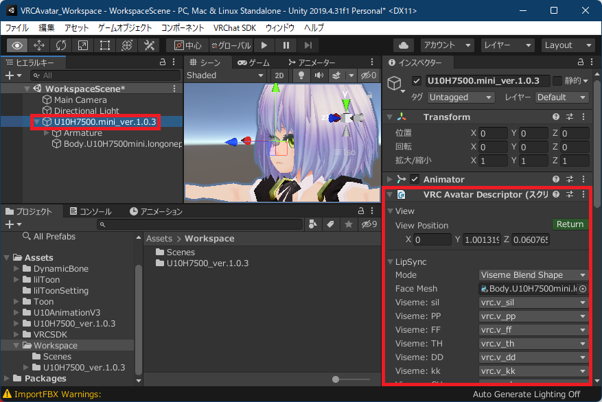

# アバターのアップロード
アバターアップロードは VRChat SDK で行います。主な作業は Builder 画面で行います。問題が有る場合にはこの画面で指摘され、指摘へ対処する事でビルドとアップロードが出来るようになります。

## 1. VRChat SDK を開く

1. Editor のメニューの `[VRChat SDK]-[Show Control Panel]` を開く
2. VRChat へログイン ... Authentication でユーザ名とパスワードを入力しログイン

## 2. エラーを除去する
アバターに問題が有る場合には指摘されます。赤い `！` マークは対処する必要があり、一部の問題は `Auto Fix` を押す事で SDK 側が対処してくれますが、不可の場合は手動で対処を要します。その他は必須ではありませんが、対処推奨です。  

スクショではテクスチャにストリーミングミニマップが有効化されていない事を指摘されています。 `Auto Fix` で対処してください。  
(参考: アバターを改造する)

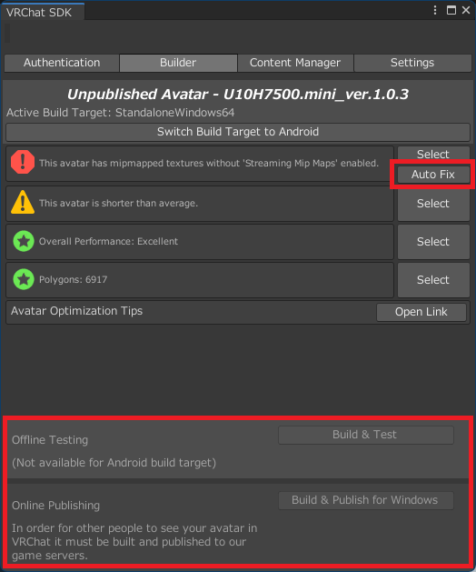

## 3. 動作確認
問題へ一通り対処するとビルドボタンが有効化されます。

Offline Testing の `Build & Test` でビルドすると、他の人にアバターを見せずに VRChat 上で動作確認ができます。押してビルドに成功すると VRChat の `AVATARS` の `Other` に追加され、使用可能になります。使用中、他の人からはテストアバターに変更する前のアバターが見えます。

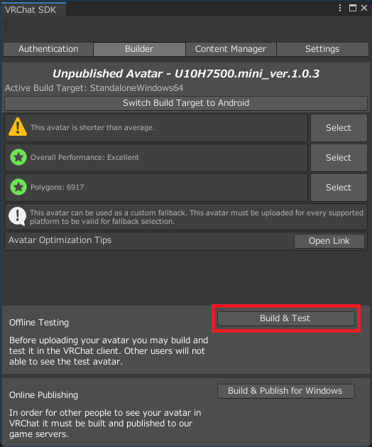
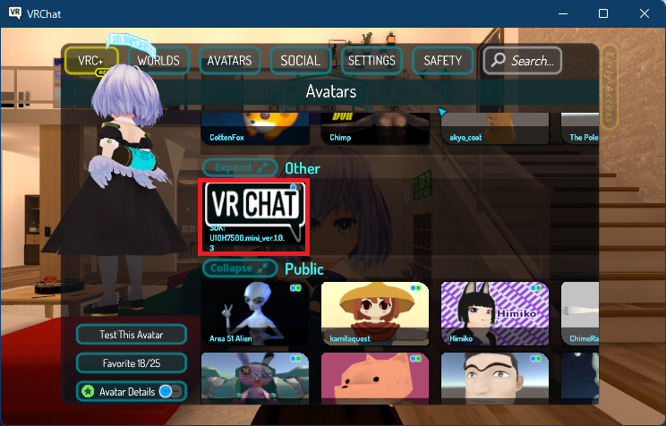

## 4. アップロード (PC 向け)
動作に問題が無ければ VRChat サーバーへ送信します。 Online Publishing の `Build & Publish for ～` でビルドを行い、必要事項を記入した上でパブリッシュします。

1. Online Publishing を行う
2. アバターの情報を記入
   1. Avatar Name ... アバター名
   2. Description ... アバターの説明文
   3. Content Warnings ... 不快表現の有無
   4. Sharing ... アバタークローン許可の有無 (Private: クローン不可. Public: クローン可)
   5. `The above information is ～` ... 記入事項が正確である事の宣言 (要チェック)

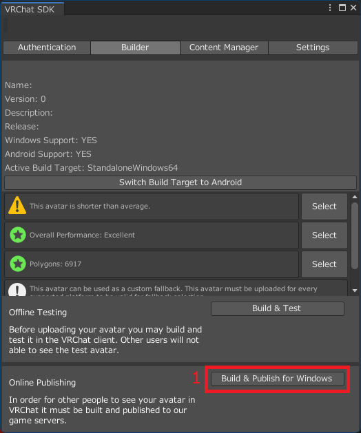
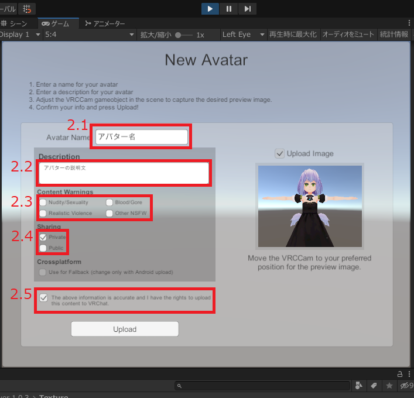

## 5. アップロード (Quest 向け)
アバターを Quest へ対応させてみます。 Quest 対応は PC 向けアバターと同じ Blueprint ID で、 Build Target を Android にしてビルド & パブリッシュすると出来ます。

PC 用アバターは FBX ファイルから作成しましたが、 Quest 用では設定済みのプレハブを使って手順を簡略化します。このように、プレハブが提供されている場合にはヒエラルキーへ配置するだけでアップロードができます。

1. シーン `U10H7500_android` を開く
2. Quest 対応アバターをヒエラルキーへ配置  
   (今回は `Assets/U10H7500_ver.1.0.3/Prefab/U10H7500.mini_ver.1.0.1.longonepice.prefab` を使用)
3. PC 版アバターの Blueprint ID を Quest 版アバターへ設定  
   (PC 版アバターの Blueprint ID をコピー。 Quest 版アバターの Blueprint ID へ貼り付けし Attach)
4. Build Target を Android へ変更
5. Build & Publish を行う
6. VRChat 上で Quest に対応した事を確認  
   (アバターサムネイル右上の右側の円に色が付いていれば成功です。左側はPC対応状態を指します)

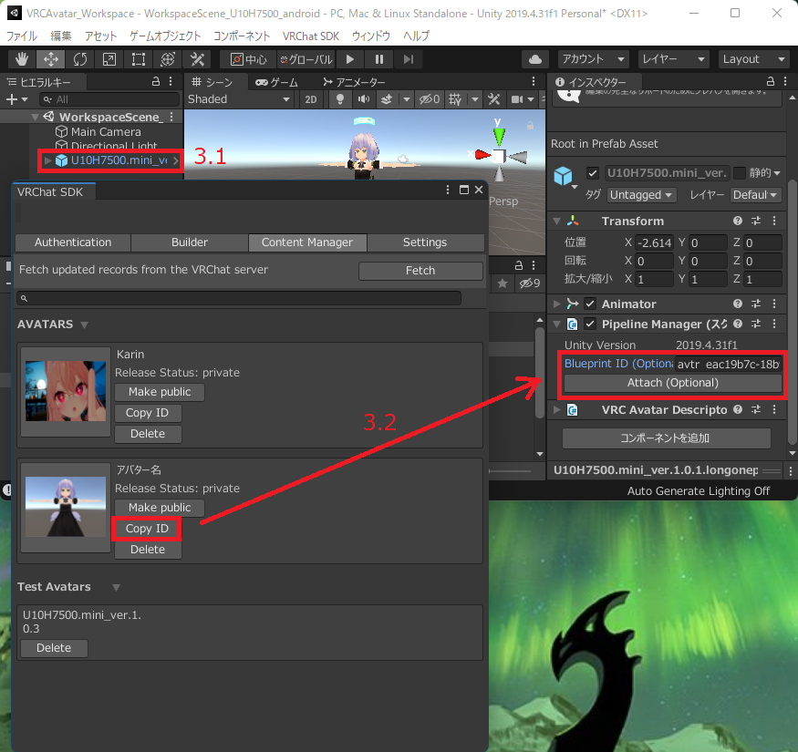
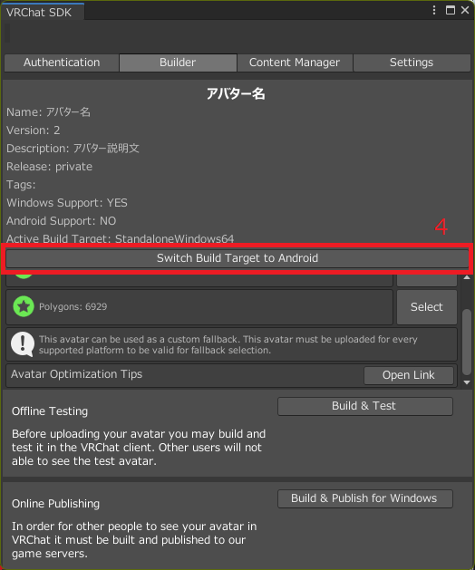
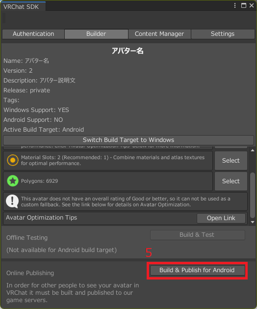
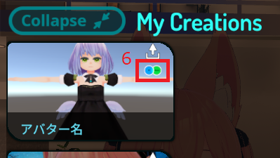

# 上手くいかない場合
**Quest 用アバターのビルド時に VRChat SDK の Build ボタンが有効化されない**  
アバターを配置しているシーン内に Quest 非対応アバターが1体以上有る場合は消してください。既知のバグとしてシーン内に1体でも存在するとビルドボタンが有効化されないバグが存在します。

# 追加要素
## アバターサムネイルの指定
VRChat 上でのアバターサムネイルはツールを使うことで任意の画像を指定可能です。

1. VRChatThumbnailer 2020 の unitypackage をインポート
2. サムネイル画像を用意 (縦横比を 3:4 にする)
3. アップロードアバターを配置しているシーンを開く
4. ヒエラルキーへ空のオブジェクトを作成
5. 空のオブジェクトへ `VR Chat Thumbnailer` コンポーネントを追加
6. `VR Chat Thumbnailer` 上でサムネイル画像を指定
